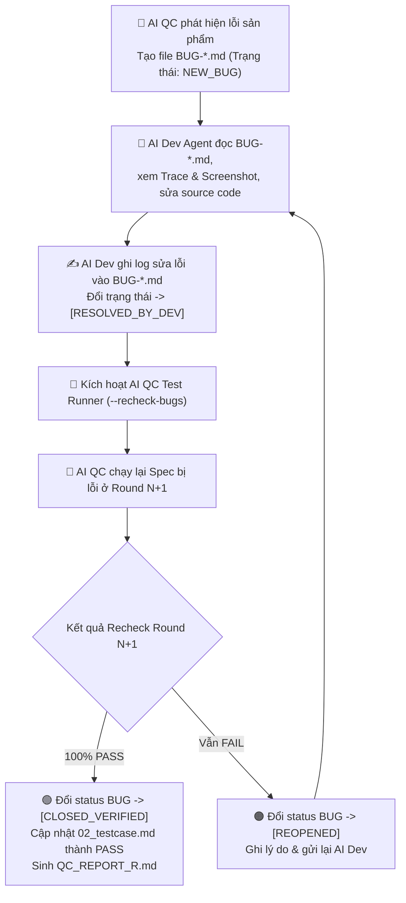

# 📖 Hướng dẫn Sử dụng Chi tiết — AI QC Playwright Pipeline (v2.4)

## Mục lục
1. [Thiết lập lần đầu (First-time Setup)](#1-thiết-lập-lần-đầu)
2. [Prompt mẫu cho từng tình huống](#2-prompt-mẫu-cho-từng-tình-huống)
3. [Chạy pipeline đầy đủ 5 bước](#3-chạy-pipeline-đầy-đủ-5-bước)
4. [Chạy từng skill riêng lẻ](#4-chạy-từng-skill-riêng-lẻ)
5. [Chạy nhiều AI Agent song song](#5-chạy-nhiều-ai-agent-song-song)
6. [Tiếp nối session bị gián đoạn](#6-tiếp-nối-session-bị-gián-đoạn)
7. [Cấu hình dự án mới](#7-cấu-hình-dự-án-mới)
8. [Xem kết quả & Bug Reports](#8-xem-kết-quả--bug-reports)
9. [Cấu hình Luồng Đăng nhập & Chuyển đổi tài khoản FTMS](#9-cấu-hình-luồng-đăng-nhập--chuyển-đổi-tài-khoản-ftms)
10. [Xem Replay Luồng Test Trực quan trên Giao diện (--ui)](#10-xem-replay-luồng-test-trực-quan-trên-giao-diện---ui)
11. [Vòng đời Đóng vết Bug Hai chiều giữa AI Dev và AI QC](#11-vòng-đời-đóng-vết-bug-hai-chiều-giữa-ai-dev-và-ai-qc)

---

## 1. Thiết lập lần đầu

### Bước 1.1 — Copy skill vào dự án
```bash
# Copy toàn bộ skill và templates vào dự án của bạn
cp -r ai-qc-playwright-pipeline/skills/* /path/to/your-project/.agents/skills/
cp ai-qc-playwright-pipeline/config/pipeline.config.json /path/to/your-project/.agents/skills/
cp ai-qc-playwright-pipeline/config/users.real.json /path/to/your-project/e2e/config/users.real.json
cp ai-qc-playwright-pipeline/templates/auth.setup.ts /path/to/your-project/e2e/auth.setup.ts
```

---

## 2. Prompt mẫu cho từng tình huống

### 🟢 Tình huống 1: Chẩn đoán Môi trường & Cài đặt Playwright (Bước 0)
```
Dùng skill ai-playwright-environment-engineer để tự động chẩn đoán Node.js, npm, Proxy/VPN, Browser binaries và cấu hình Playwright cho dự án của tôi.
```

### 🟡 Tình huống 2: Kiểm thử luồng FTMS nhiều vai trò (User Switching)
```
Hãy dùng qc-pipeline-orchestrator để kiểm thử luồng FTMS "Phê duyệt phiếu yêu cầu hợp đồng":
- Luồng bao gồm các vai trò: Salesman (tạo phiếu) -> Legal Assignor (gán chuyên viên) -> Legal Reviewer (thẩm định) -> Deputy Signer (ký duyệt)
- Sử dụng cấu hình người dùng tại e2e/config/users.real.json và auth setup e2e/auth.setup.ts
```

---

## 3. Chạy pipeline đầy đủ 5 bước

Prompt đầy đủ nhất để pipeline tự động chẩn đoán môi trường và điều phối 5 bước độc lập (có dừng báo cáo Team Progress Dashboard sau mỗi bước):

```
Hãy khởi chạy qc-pipeline-orchestrator.
Tôi muốn kiểm thử tính năng [TÊN TÍNH NĂNG] của dự án.
Trước tiên hãy tự động chẩn đoán môi trường và hỏi tôi nếu cần thêm thông tin.
```

---

## 4. Chạy từng skill riêng lẻ

- **Step 0**: `ai-playwright-environment-engineer` (Auto-Diagnostics & Setup)
- **Step 1**: `ai-qa-lead` (Phân tích URD & QC Spec)
- **Step 2**: `ai-testcase-generator` (Sinh testcase 8 Trụ cột)
- **Step 3**: `ai-playwright-spec-builder` (Sinh code Playwright POM & Spec)
- **Step 4**: `ai-playwright-test-runner` (Run REAL Mode, Self-Healing, Report, Bug Lifecycle)

---

## 10. Xem Replay Luồng Test Trực quan trên Giao diện (--ui)

Sau khi AI chạy xong test, bạn có thể tự mình xem lại từng chuyển động màn hình E2E thực tế mà AI đã chạy bằng câu lệnh Terminal có sẵn trong Report và Dashboard:

### 1. Xem Playwright UI Interactive (Xem test chạy trực quan từng bước):
```bash
cd /path/to/your-project && npx playwright test e2e/features/order/order.spec.ts --project=chromium --ui
```

### 2. Xem Playwright Trace Viewer cho testcase bị lỗi:
```bash
npx playwright show-trace docs/qc-sessions/<SESSION_ID>/04_test_results/traces/trace-TC_03.zip
```

---

## 11. Vòng đời Đóng vết Bug Hai chiều giữa AI Dev và AI QC



### Lệnh để AI QC Recheck Bug tự động (sau khi Dev fix):
```
Dùng skill ai-playwright-test-runner --recheck-bugs cho session <SESSION_ID>
```
