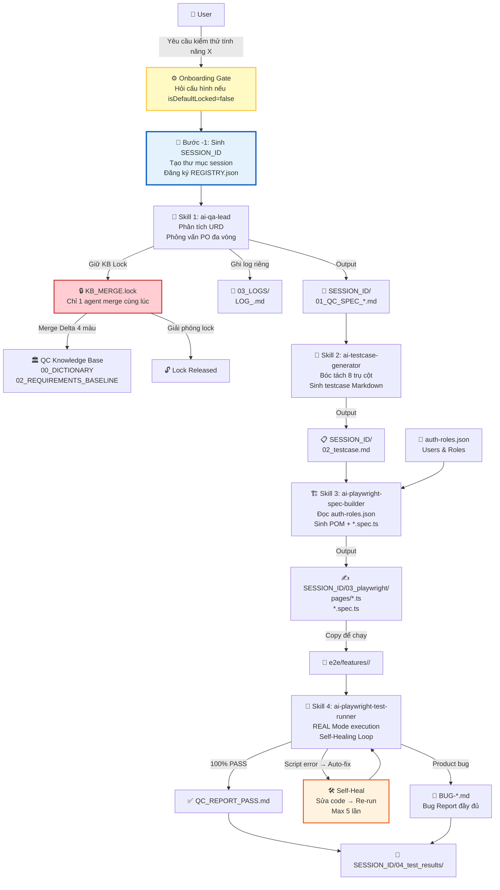
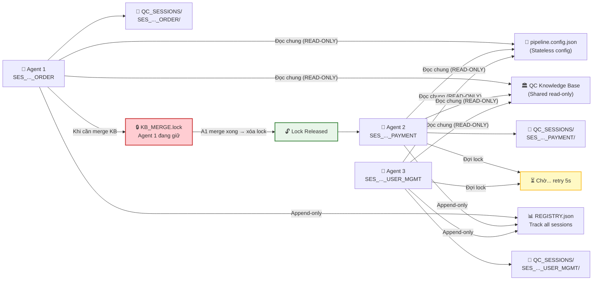
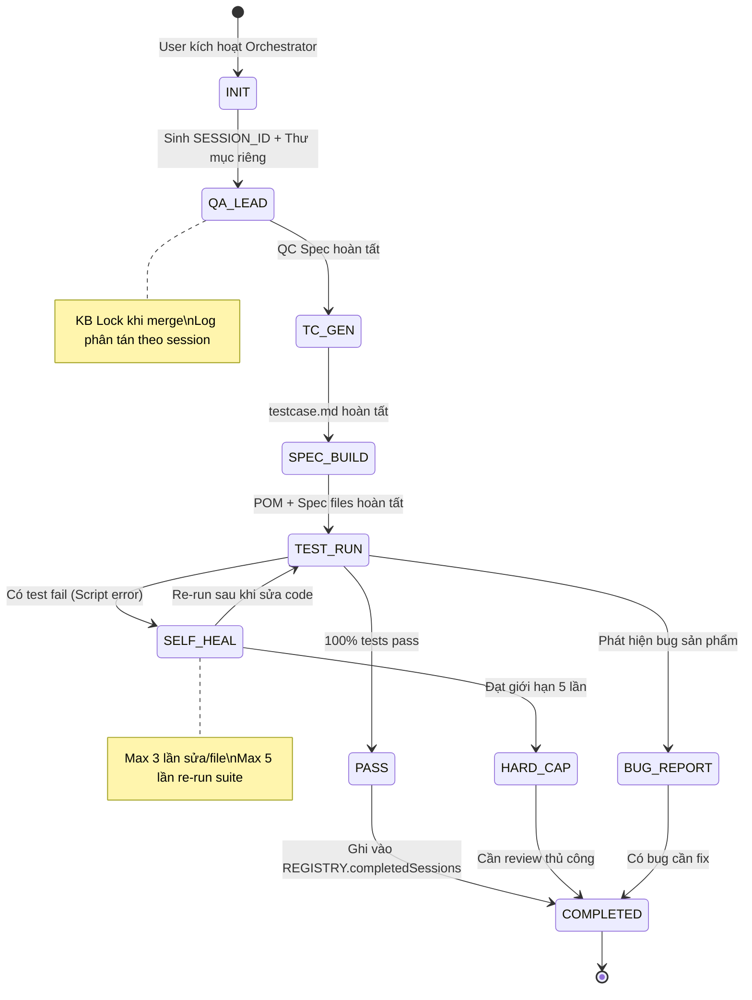
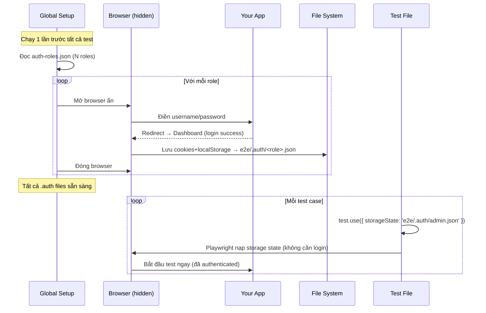

# 📊 Sơ đồ Luồng Hoạt động Chi tiết

## 1. Luồng Pipeline Tổng thể



---

## 2. Luồng Multi-Agent Concurrent (3 Agent song song)



---

## 3. Luồng Session Lifecycle



---

## 4. Luồng Xác thực (SSO Flow)



---

## 5. Cấu trúc thư mục output

```
your-project/
├── docs/
│   ├── qc-sessions/
│   │   ├── REGISTRY.json                          ← Track tất cả sessions
│   │   ├── SES_20260727_143000_ORDER/              ← Session Agent 1
│   │   │   ├── SESSION_CONTEXT.json
│   │   │   ├── 01_QC_SPEC_ORDER_v1.0.md
│   │   │   ├── 02_testcase.md
│   │   │   ├── 03_playwright/
│   │   │   │   ├── pages/OrderPage.ts
│   │   │   │   └── order.spec.ts
│   │   │   └── 04_test_results/
│   │   │       ├── QC_REPORT_R1.md
│   │   │       ├── BUG-ORDER-001.md
│   │   │       └── traces/
│   │   └── SES_20260727_143052_PAYMENT/            ← Session Agent 2 (độc lập)
│   │       └── ...
│   └── qc-specs/
│       ├── .locks/
│       │   └── KB_MERGE.lock   ← Tạm thời khi 1 agent đang merge
│       ├── logs/
│       │   ├── LOG_ORDER_SES_20260727_143000.md   ← Log riêng session 1
│       │   └── LOG_PAYMENT_SES_20260727_143052.md ← Log riêng session 2
│       ├── 00_BUSINESS_DICTIONARY.md
│       ├── 02_REQUIREMENTS_BASELINE.md
│       └── FEATURE_SPECS/
│           ├── QC_SPEC_ORDER_v1.0.md
│           └── QC_SPEC_PAYMENT_v1.0.md
└── e2e/
    ├── .auth/                                      ← Auth storage states (git-ignored)
    │   ├── admin.json
    │   ├── manager.json
    │   └── staff.json
    ├── config/
    │   ├── auth-roles.json                         ← (git-ignored)
    │   └── sso-config.json                         ← (git-ignored)
    ├── global-setup.ts
    ├── playwright.config.ts
    ├── pages/                                      ← POM classes
    │   ├── OrderPage.ts
    │   └── PaymentPage.ts
    └── features/                                   ← Spec files
        ├── order/
        │   └── order.spec.ts
        └── payment/
            └── payment.spec.ts
```
