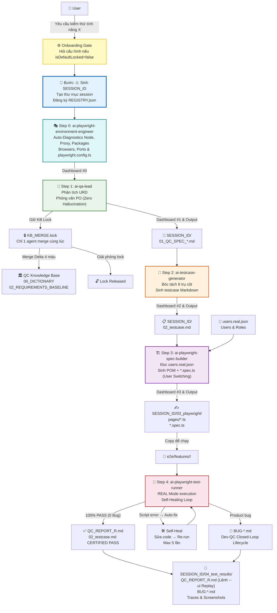
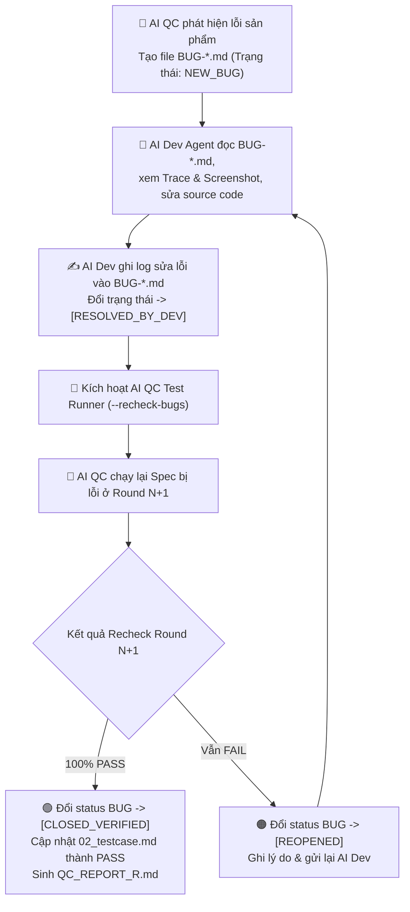
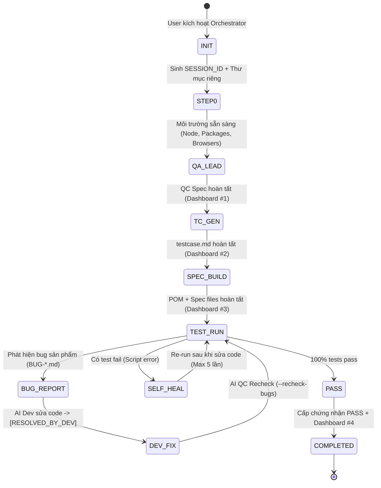

# 📊 Sơ đồ Luồng Hoạt động Chi tiết (Workflow Diagrams v2.4)

## 1. Luồng Pipeline 5 Bước (5-Step Modular Pipeline)



---

## 2. Vòng đời Đóng vết Bug Hai chiều giữa AI Dev và AI QC (Dev-QC Closed-Loop Bug Lifecycle)



---

## 3. Luồng Session Lifecycle & Multi-Agent Concurrent



---

## 4. Cấu trúc thư mục Runtime Output hoàn chỉnh (v2.4)

```
your-project/
├── docs/
│   ├── qc-sessions/
│   │   ├── REGISTRY.json                          ← Track tất cả sessions
│   │   ├── SES_20260727_143000_ORDER/              ← Session Agent 1 (Độc lập)
│   │   │   ├── SESSION_CONTEXT.json
│   │   │   ├── 01_QC_SPEC_ORDER_v1.0.md
│   │   │   ├── 02_testcase.md                     ← [Certified 100% PASS]
│   │   │   ├── 03_playwright/
│   │   │   │   ├── pages/OrderPage.ts
│   │   │   │   └── order.spec.ts
│   │   │   └── 04_test_results/
│   │   │       ├── QC_REPORT_R1.md                ← [Chứa lệnh terminal --ui]
│   │   │       ├── BUG-ORDER-001.md               ← [Closed-loop Dev-QC report]
│   │   │       └── traces/
│   │   │           ├── screenshot-fail.png
│   │   │           └── trace-TC_03.zip
│   │   └── SES_20260727_143052_PAYMENT/            ← Session Agent 2 (Độc lập)
│   │       └── ...
│   └── qc-specs/
│       ├── .locks/
│       │   └── KB_MERGE.lock                      ← Tạm thời khi 1 agent đang merge
│       ├── logs/
│       └── FEATURE_SPECS/
└── e2e/
    ├── .auth/                                      ← Auth storage states (.auth/<role>.json)
    ├── config/
    │   └── users.real.json                        ← Cấu hình roles & accounts
    ├── auth.setup.ts                              ← Auth setup 4 tầng (Mock, Token, API, SSO OTP)
    ├── playwright.config.ts                       ← Config đã được tối ưu
    ├── pages/
    └── features/
```
