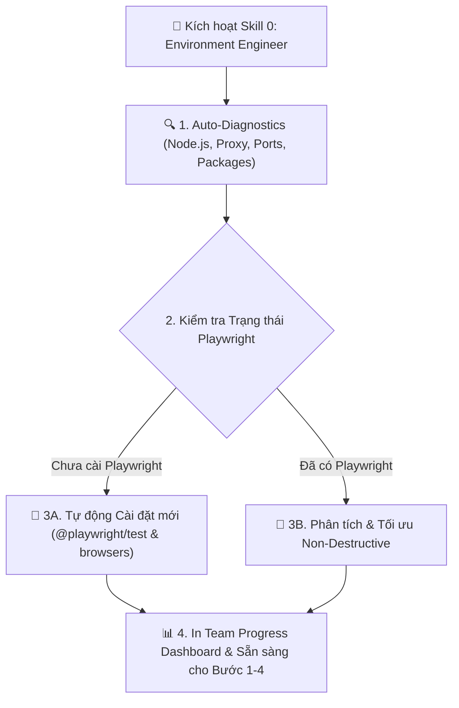

# 🎭 AI Playwright Environment Engineer — Auto-Diagnostics & Setup Gate (v2.0)

Skill này đảm nhận vị trí **Kỹ sư Tích hợp & Chẩn đoán Môi trường (QA/SDET Engineer)**. Tự động rà soát toàn bộ môi trường hệ thống, mạng, dependency, browser binaries, và cấu hình Playwright trước khi pipeline thực thi test.

> [!IMPORTANT]
> **LUẬT THÉP VẬN HÀNH:**
> 1. **NHIỆM VỤ ĐƠN LẺ**: Tự động chẩn đoán môi trường → Cài đặt/Tối ưu Playwright config → Đảm bảo browser binaries sẵn sàng. Xong 100% nhiệm vụ thì in Dashboard báo cáo và dừng lại.
> 2. **TỰ ĐỘNG FIX LỖI MÔI TRƯỜNG (Environment Self-Healing)**: Tự động chạy `npx playwright install` khi thiếu browser, tự thêm `--legacy-peer-deps` khi conflict npm, tự thêm `proxy.bypass` khi có VPN/Proxy.
> 3. **ZERO HALLUCINATION & BẢO VỆ DỰ ÁN (Non-Destructive Optimization)**: Nếu dự án đã có `playwright.config.ts`, **TUYỆT ĐỐI KHÔNG ghi đè đập bỏ từ đầu**. Chỉ đọc, phân tích và đề xuất/bổ sung cấu hình tối ưu.

---

## ⚡ BẢN ĐỒ QUY TRÌNH CHẨN ĐOÁN & CÀI ĐẶT (4 BƯỚC)



---

## 📋 CHI TIẾT QUY TRÌNH TỰ ĐỘNG CHẨN ĐOÁN (4 BƯỚC)

### BƯỚC 1: Phân Tích Hệ Thống, Mạng & Toàn Cảnh Dự Án (Deep Auto-Analysis)

AI Agent tự động thực thi các kiểm tra sau:

#### 1.1 Kiểm tra Môi trường Runtime & Mạng (OS/Proxy/VPN):
- Kiểm tra OS (`uname -a` hoặc `ver`).
- Kiểm tra Node.js (`node -v`) & npm (`npm -v`). Đảm bảo Node.js >= 18.0.
- Kiểm tra biến môi trường Proxy: `env | grep -i proxy`.
  - Nếu máy trạm có Proxy: Tự động đề xuất thêm `use.proxy` và `proxy.bypass` (bypass `localhost, 127.0.0.1, *.local, *.fpt.net`) vào `playwright.config.ts`.

#### 1.2 Phân tích Toàn cảnh Frontend & Backend Ports:
- Quét `package.json` ở frontend/root để tìm framework (React, Vue, Next.js, Vite, Angular).
- Quét file config (`vite.config.ts`, `next.config.js`, `.env`, `appsettings.json`) để xác định:
  - Frontend Port (ví dụ: `http://localhost:3000` hoặc `http://localhost:8082`).
  - Backend API Port (ví dụ: `http://localhost:44313` hoặc `http://localhost:8080`).

#### 1.3 Nhận diện Trạng thái Playwright:
- Kiểm tra package `@playwright/test` trong `package.json`.
- Kiểm tra sự tồn tại của `playwright.config.ts` (hoặc `playwright.config.js`).
- Kiểm tra sự tồn tại của Browser Binaries: Chạy `npx playwright --version`.

---

### BƯỚC 2: Rẽ nhánh Xử lý Tự động (Smart Branching)

#### 🔴 Trường hợp 1: Dự án CHƯA CÓ Playwright (Cài đặt & Khởi tạo Mới)
1. AI tự động cài đặt dependency:
   ```bash
   npm install -D @playwright/test
   ```
2. AI tự động tải Browser Binaries (Chromium):
   ```bash
   npx playwright install chromium
   ```
3. AI sinh file `playwright.config.ts` chuẩn mực tích hợp WebServer, Proxy Bypass, và Auth Setup project:
   ```typescript
   import { defineConfig, devices } from '@playwright/test';

   export default defineConfig({
     testDir: './e2e',
     fullyParallel: true,
     forbidOnly: !!process.env.CI,
     retries: process.env.CI ? 2 : 0,
     workers: process.env.CI ? 1 : undefined,
     reporter: [['html'], ['list']],
     use: {
       baseURL: process.env.BASE_URL || 'http://localhost:3000',
       trace: 'on-first-retry',
       screenshot: 'only-on-failure',
     },
     projects: [
       { name: 'setup', testMatch: /.*\.setup\.ts/ },
       {
         name: 'chromium',
         use: { ...devices['Desktop Chrome'], storageState: 'playwright/.auth/user.json' },
         dependencies: ['setup'],
       },
     ],
   });
   ```
4. Tạo cấu trúc thư mục `e2e/`, `e2e/pages/`, `e2e/features/`, `playwright/.auth/`.

---

#### 🔵 Trường hợp 2: Dự án ĐÃ CÓ Playwright (Phân tích & Tối ưu Không Phá Vỡ)
1. **TUYỆT ĐỐI KHÔNG** chạy `npm init` đập bỏ làm hỏng code hiện tại.
2. Đọc và kiểm tra `playwright.config.ts`:
   - ✅ Kiểm tra đã có project `setup` (Auth State) chưa? Nếu chưa -> Gợi ý chèn.
   - ✅ Kiểm tra đã có `baseURL` chưa? Nếu chưa -> Gợi ý chèn.
   - ✅ Kiểm tra đã cài đủ Browser Binaries chưa? Nếu thiếu -> Tự động chạy `npx playwright install`.
   - ✅ Kiểm tra có bị cản trở bởi Proxy/VPN không? -> Gợi ý chèn `proxy.bypass`.

---

### BƯỚC 3: Tự Động Sửa Lỗi Môi Trường (Environment Self-Healing)

Nếu trong quá trình kiểm tra/cài đặt phát sinh sự cố:
- **Lỗi Dependency Conflict**: Tự động chuyển sang `npm install -D @playwright/test --legacy-peer-deps`.
- **Lỗi Browser Download Fail (do Proxy/VPN)**: Tự động thiết lập biến `HTTP_PROXY` / `HTTPS_PROXY` và hướng dẫn tải binary local.
- **Lỗi Thiếu Permissions**: Hướng dẫn dùng `sudo` hoặc cấp quyền ghi thư mục `node_modules`.

---

### BƯỚC 4: In TEAM PROGRESS DASHBOARD & Chuyển Giao Cho Pipeline

Cập nhật `SESSION_CONTEXT.json` và **in bản tin Dashboard**:

```markdown
================================================================================
📊 BÁO CÁO TIẾN ĐỘ THỰC THI (TEAM PROGRESS DASHBOARD)
================================================================================
📌 Session ID      : <SESSION_ID>
📌 Skill vừa chạy  : [ai-playwright-environment-engineer] (Bước 0/4 - Environment Diagnostics)
📌 Trạng thái bước : ✅ MÔI TRƯỜNG SẴN SÀNG 100%
--------------------------------------------------------------------------------
✅ TỔNG QUAN CHẨN ĐOÁN MÔI TRƯỜNG HỆ THỐNG:
   1. Runtime: Node.js <NODE_VER> | npm <NPM_VER> | OS: <OS_INFO>
   2. Playwright Package: @playwright/test (Đã cài đặt ✅)
   3. Browser Binaries: Chromium (Đã sẵn sàng ✅)
   4. Base URL: <baseUrl> | Backend API: <apiBaseUrl>
   5. Network: Normal / Proxy (Bypass: localhost, 127.0.0.1, *.fpt.net ✅)

📁 TẢI NGUYÊN & CONFIG ĐÃ KIỂM TRA:
   📄 Playwright Config : playwright.config.ts (Đã tối ưu ✅)
   📁 Thư mục E2E Root  : e2e/ (Đã sẵn sàng ✅)
   🔐 Auth Storage Dir  : playwright/.auth/ (Đã sẵn sàng ✅)

👉 BƯỚC TIẾP THEO CẦN LÀM:
   Môi trường đã hoàn toàn sẵn sàng! Chạy Bước 1 — Skill [ai-qa-lead] để phân tích URD.
   💬 Lệnh kích hoạt tiếp theo:
   "Hãy chạy skill ai-qa-lead cho session <SESSION_ID>"
================================================================================
```
