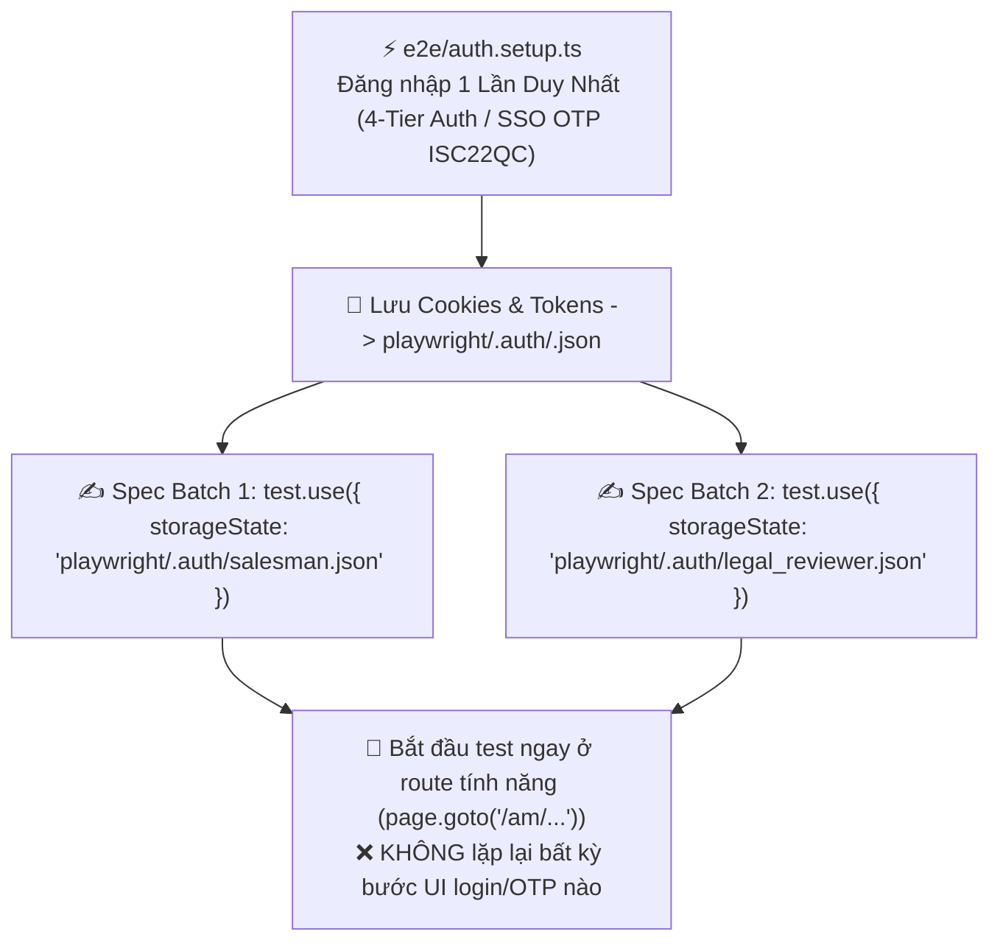

# 🏗️ AI Playwright Spec Builder — Single Auth Storage State & Spec Generator (v2.7)

Skill này chuyển thể danh sách **Testcase Markdown (`02_testcase.md`)** thành mã nguồn Playwright E2E. Tuân thủ nghiêm ngặt **Quy tắc Đăng nhập 1 Lần Duy Nhất (Single Storage State Auth)** dựa trên tài liệu `04_SSO_OTP_AUTH_FALLBACK_SPEC.md`.

---

## 🔐 QUY TẮC TỐI ƯU ĐĂNG NHẬP 1 LẦN DUY NHẤT (SINGLE AUTH STORAGE STATE DIRECTIVE)

> [!IMPORTANT]
> **TỐI ƯU HIỆU NĂNG XÁC THỰC (BẮT BUỘC TUÂN THỦ):**
> Theo tài liệu `04_SSO_OTP_AUTH_FALLBACK_SPEC.md`, luồng đăng nhập (gồm SSO OTP fallback `ISC22QC`, API Test token, hoặc Real Token) **CHỈ ĐƯỢC THỰC THI 1 LẦN DUY NHẤT** tại `e2e/auth.setup.ts` và ghi vào `playwright/.auth/<roleKey>.json`.



### 🚫 Các điều CẤM trong file Spec (`*.spec.ts`):
1. **CẤM** viết lại các bước UI login (chọn OTP ➔ điền email `longht17@fpt.com` ➔ điền `ISC22QC` ➔ submit) bên trong từng testcase hay `beforeEach`.
2. **CẤM** gọi lại API login lặp đi lặp lại giữa các testcases của cùng một vai trò.

### ✅ Các quy tắc BẮT BUỘC trong file Spec (`*.spec.ts`):
1. Khai báo storage state ở đầu file/describe block:
   ```typescript
   test.use({ storageState: 'playwright/.auth/salesman.json' });
   ```
2. Mỗi testcase đi thẳng vào trang tính năng và thực thi ngay:
   ```typescript
   test('TC_1.1: Tạo đơn hàng thành công', async ({ page }) => {
     // Đã tự động authenticated nhờ storageState
     await page.goto('/am/review-request/create');
     // Thao tác nghiệp vụ trực tiếp...
   });
   ```

---

## ⚡ CƠ CHẾ CHIA ĐỢT TỰ ĐỘNG (AUTOMATIC CHUNKING & MULTI-SPEC BATCHING)

Nếu $N > 15$ testcases ➔ Tự động chia đợt (`01_HappyPath.spec.ts`, `02_Negative_Boundary.spec.ts`...) và tái sử dụng 1 file POM Class (`<FeatureName>Page.ts`).

---

## 💾 ĐẦU RA (SESSION-SCOPED OUTPUT)

1. `<SESSION_ID>/03_playwright/pages/<FeatureName>Page.ts` — Shared POM Class
2. `<SESSION_ID>/03_playwright/specs/*.spec.ts` — Spec Batches dùng `storageState` đăng nhập 1 lần.
3. Copy đồng bộ ra `<paths.e2eFeaturesDir>/<SESSION_ID>/`.
