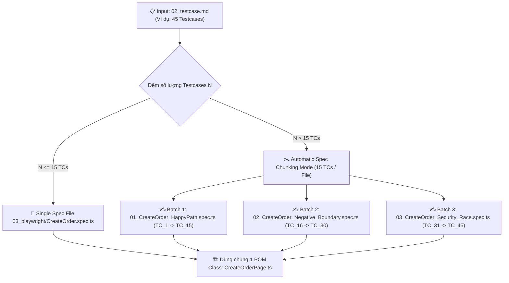

# 🏗️ AI Playwright Spec Builder — Automatic Spec Chunking & Code Generator (v2.6)

Skill này chuyển thể danh sách **Testcase Markdown (`02_testcase.md`)** thành mã nguồn Playwright E2E. Đảm bảo **tự động chia đợt (Chunking Mode)** khi file testcase quá dài để 100% testcase đều được sinh code tỉ mỉ, đầy đủ assertions và không bao giờ bị cắt ngắn.

---

## ⚡ CƠ CHẾ CHIA ĐỢT TỰ ĐỘNG (AUTOMATIC CHUNKING & MULTI-SPEC BATCHING)

> [!IMPORTANT]
> **QUY TẮC CHIA ĐỢT NẾU FILE TESTCASE QUÁ DÀI:**
> Kích thước file testcase lớn (30 - 80+ testcases) sẽ tự động được AI chia nhỏ thành các **Batches / Sub-spec Files** để đảm bảo chất lượng code 100% chính xác, không bị đứt đoạn hay viết tắt `// TODO`.

### Quy tắc sinh file khi Chunking:
1. **Dùng chung 1 Page Object Model (POM) Class**: Chỉ tạo 1 file `<FeatureName>Page.ts` duy nhất để tái sử dụng toàn bộ locators và action functions.
2. **Phân chia theo Trụ cột / Nhóm tính năng**:
   - `01_<FeatureName>_HappyPath.spec.ts` — Bao phủ luồng chính & multi-role (P1).
   - `02_<FeatureName>_Negative_Boundary.spec.ts` — Bao phủ validation, boundary & malformed inputs (P2, P3).
   - `03_<FeatureName>_Security_Race.spec.ts` — Bao phủ IDOR, RBAC, Race condition, Integrity (P4, P5, P6, P7, P8).
3. **Mỗi Testcase sinh đầy đủ 100%**: Đủ Steps to Reproduce, Web-First Assertions (`expect(locator).toBeVisible()`), Data Payload, tuyệt đối **KHÔNG viết tắt `// TODO`**.

---

## 🛠️ QUY TẮC PHÁT SINH MÃ CODE PLAYWRIGHT

### 1. Page Object Model (POM) Class:
Sinh tại `<SESSION_ID>/03_playwright/pages/<FeatureName>Page.ts`.

### 2. Playwright Spec Files (Batches):
Sinh các file Spec tại `<SESSION_ID>/03_playwright/specs/`.

---

## 💾 ĐẦU RA (SESSION-SCOPED OUTPUT)

1. `<SESSION_ID>/03_playwright/pages/<FeatureName>Page.ts` — Shared POM Class
2. `<SESSION_ID>/03_playwright/specs/01_*.spec.ts`, `02_*.spec.ts`... — Spec Batches
3. Copy đồng bộ ra `<paths.e2eFeaturesDir>/<SESSION_ID>/` để Playwright Test Runner chạy theo từng đợt.
