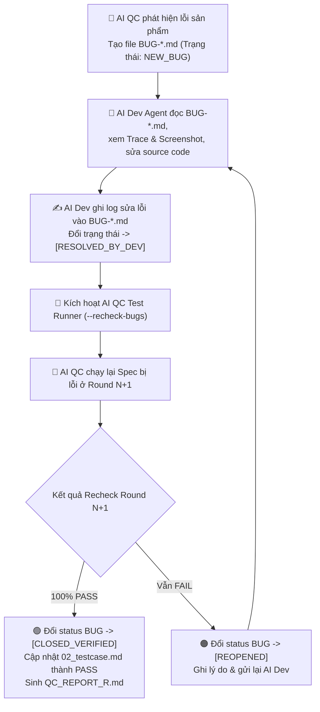

# 🚀 AI Playwright Test Runner — Self-Healing & Closed-Loop Dev-QC Bug Lifecycle Engine (v2.2)

Skill này thực thi Playwright test, tự sửa lỗi script, **TẠO REPORT CHI TIẾT SAU MỖI ROUND TEST**, **TỰ ĐỘNG CẬP NHẬT FILE TESTCASE (đánh dấu PASS/FAIL và cấp Chứng nhận QC khi 0 bug)**, và **CUNG CẤP CƠ CHẾ ĐÓNG VẾT BUG HAI CHIỀU GIỮA AI DEV VÀ AI QC (Dev fix -> QC Recheck tự động -> Close Bug)**. Multi-Agent Safe — mỗi session lưu kết quả riêng biệt.

---

## 🔄 BƯỚC 0: NHẬN SESSION & XÁC NHẬN THÔNG TIN

### Nhận SESSION_ID:
- **Từ Orchestrator**: Dùng SESSION_ID được truyền vào.
- **Standalone**: Tự sinh `SES_<YYYYMMDD>_<HHmmss>_TEST_RUN`.

### Đọc `pipeline.config.json` — CHỈ ĐỌC:
- Lấy: `paths.e2eFeaturesDir`, `paths.bugReportDir`, `paths.sessionRegistryDir`, `paths.testcaseOutputDir`
- Lấy: `testRunner.maxSuiteReruns`, `testRunner.maxSelfHealPerFile`, `testRunner.browser`, `testRunner.baseUrl`

### Hỏi xác nhận nếu cần:
```
🚀 [TEST RUNNER CONFIRMATION]

1. Bạn muốn chạy chế độ nào?
   → A) Chạy Full Test Suite (Mới từ đầu hoặc tiếp nối)
   → B) Chế độ RECHECK BUGS (Quét các BUG-*.md đã được AI Dev đánh dấu RESOLVED_BY_DEV để kiểm tra lại)

2. Môi trường chạy test:
   → A) Local: http://localhost:<port>
   → B) Staging: https://staging.yourapp.com

3. Browser:
   → A) chromium (mặc định)
   → B) firefox / webkit
```

---

## 🔄 LUỒNG TƯƠNG TÁC ĐÓNG VẾT BUG GIỮA AI DEV & AI QC (CLOSED-LOOP LIFECYCLE)



---

## ⚡ QUY TRÌNH THỰC THI CHUẨN (6 BƯỚC)

### Bước 1: Thực thi Playwright Suite (Round N)
```bash
PLAYWRIGHT_BASE_URL=<baseUrl> npx playwright test \
  <e2eFeaturesDir>/<FEATURE_ID>/<FeatureName>.spec.ts \
  --project=<browser> \
  --reporter=html,list
```

---

### Bước 2: Phân loại Lỗi & Self-Diagnosis
- **LOẠI 1 (Lỗi Script)**: Selector timeout, modal hidden, missing await → **AI QC TỰ SỬA MÃ TEST (Self-Healing)** và Re-Run.
- **LOẠI 2 (Lỗi Sản Phẩm)**: API 500, UI sai URD, DB rò rỉ → **SINH FILE BUG REPORT (`BUG-*.md`) CHUẨN ĐÓNG VẾT HOÀN CHỈNH**.

---

### Bước 3: SINH FILE BUG REPORT CHUẨN ĐÓNG VẾT (`BUG-[MODULE]-[ID].md`)

Khi phát hiện lỗi sản phẩm thực tế, AI QC tạo file `<SESSION_ID>/04_test_results/BUG-[MODULE]-[ID].md`:

```markdown
# 🐛 BUG-[MODULE]-[ID]: [Tiêu đề ngắn mô tả lỗi]

> **Trạng thái vòng đời**: `[NEW_BUG]`
> **Mức độ nghiêm trọng**: `[Critical | High | Medium | Low]`
> **Session ID**: `<SESSION_ID>`
> **QC Spec**: `<SESSION_ID>/01_QC_SPEC_*.md`
> **Testcase**: `<SESSION_ID>/02_testcase.md#TC_<ID>`
> **Playwright Spec**: `<SESSION_ID>/03_playwright/*.spec.ts:L<line>`

---

## 📋 1. Thông tin Chi tiết Lỗi (AI QC tạo)
- **Mô tả hiện tượng**: [Mô tả chi tiết lỗi]
- **Các bước tái hiện (Steps to Reproduce)**:
  1. [Bước 1...]
  2. [Bước 2...]
- **Kết quả mong đợi (Expected)**: [Theo URD]
- **Kết quả thực tế (Actual)**: [Lỗi thực tế từ Playwright / API Log]
- **Bằng chứng**:
  - Screenshot: `04_test_results/traces/screenshot-fail-TC_03.png`
  - Playwright Trace: `04_test_results/traces/trace-TC_03.zip`

---

## 🤖 2. Hướng dẫn dành cho AI Dev Agent (Instructions for AI Dev)
> **Gửi AI Dev Agent:**
> 1. Đọc thông tin trên và file trace tại `04_test_results/traces/`.
> 2. Sửa mã nguồn sản phẩm (Backend API / Frontend Web / DB schema).
> 3. Sau khi sửa xong và test local thành công, **cập nhật Mục 3 bên dưới** (`Dev Resolution Log`):
>    - Đổi `Trạng thái vòng đời` ở đầu file thành: `[RESOLVED_BY_DEV]`
>    - Điền danh sách file đã sửa và commit hash vào Mục 3.
> 4. Yêu cầu AI QC kiểm tra lại bằng lệnh:
>    `ai-playwright-test-runner --recheck-bug <SESSION_ID>/04_test_results/BUG-[MODULE]-[ID].md`

---

## 🛠️ 3. Nhật ký Sửa lỗi của AI Dev (AI Dev Resolution Log)
*(AI Dev tự động điền mục này sau khi fix xong code)*
- **AI Dev Agent ID**: `<Dev Agent ID>`
- **Thời điểm hoàn tất fix**: `<ISO timestamp>`
- **Mã nguồn đã sửa (Changed Files)**:
  - `src/controllers/order.controller.ts` (L120: fix validation logic)
- **Commit Hash / PR**: `commit a1b2c3d`
- **Giải thích phương án sửa**: [Giải thích cách fix]

---

## 🧪 4. Nhật ký Kiểm tra lại của AI QC (AI QC Re-verification Log)
*(AI QC tự động điền mục này sau khi recheck)*
- **Round kiểm tra lại**: `Round <N+1>`
- **Thời điểm Recheck**: `<ISO timestamp>`
- **Kết quả Recheck**: `[PASSED ✅ / FAILED ❌]`
- **Cập nhật Trạng thái cuối**: `[CLOSED_VERIFIED ✅]` *(nếu Pass)* HOẶC `[REOPENED ❌]` *(nếu vẫn Fail)*
- **Ghi chú QC**: [Xác nhận lỗi đã được khắc phục 100% trên môi trường thật]
```

---

### Bước 4: Chế độ RECHECK BUGS Tự động (`--recheck-bugs`)

Khi chạy ở chế độ Recheck (hoặc khi AI Dev sửa xong bug và yêu cầu recheck):

1. AI QC quét tất cả file `BUG-*.md` có `Trạng thái vòng đời: [RESOLVED_BY_DEV]`.
2. Đọc dòng `Playwright Spec` trong `BUG-*.md` để xác định file test và testcase cần chạy lại.
3. Chạy lại Playwright test ở Round $N+1$.
4. Cập nhật kết quả:
   - **NẾU PASS 100%**:
     - Đổi status trong `BUG-*.md` thành `[CLOSED_VERIFIED ✅]`.
     - Cập nhật Nhật ký Mục 4 trong `BUG-*.md`.
     - Cập nhật trạng thái testcase trong `02_testcase.md` thành `[STATUS: ✅ PASS | Verified: Round N+1 (Bug Resolved)]`.
     - Xuất báo cáo `QC_REPORT_R<N+1>.md` xác nhận bug đã được đóng vết.
   - **NẾU VẪN FAIL**:
     - Đổi status trong `BUG-*.md` thành `[REOPENED ❌]`.
     - Ghi thêm chi tiết lỗi còn tồn đọng vào Mục 4 để AI Dev tiếp tục sửa.

---

### Bước 5: TỰ ĐỘNG SINH QC_REPORT_R<N>.md & CẬP NHẬT 02_testcase.md
- Sau mỗi round test, xuất file `<SESSION_ID>/04_test_results/QC_REPORT_R<N>.md`.
- Cập nhật file `<SESSION_ID>/02_testcase.md` (đánh dấu PASS/FAIL, nếu 0 bug thì chèn block **🏆 QC EXECUTION CERTIFIED — 100% PASS**).

---

### Bước 6: Self-Healing Loop & Hard Cap Safety
- Max 3 lần self-heal/file, max 5 lần re-run suite.

---

## 💾 OUTPUT (SESSION-SCOPED)

1. `<SESSION_ID>/04_test_results/QC_REPORT_R<N>.md` — File report chi tiết sau **MỖI** Round test.
2. `<SESSION_ID>/02_testcase.md` — File testcase **ĐÃ CẬP NHẬT TRẠNG THÁI & CHỨNG NHẬN PASS / FAIL**.
3. `<SESSION_ID>/04_test_results/BUG-*.md` — File Bug Report có **ĐỦ HƯỚNG DẪN AI DEV FIX & NHẬT KÝ ĐÓNG VẾT HAI CHIỀU**.
4. `<SESSION_ID>/04_test_results/traces/` — Playwright traces & screenshots.
