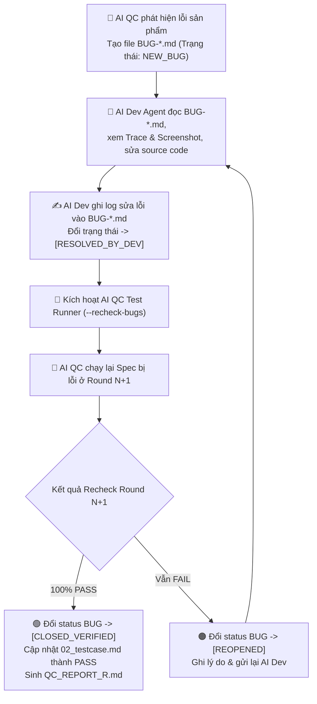

# 🚀 AI Playwright Test Runner — Self-Healing & Closed-Loop Dev-QC Bug Lifecycle Engine (v2.3)

Skill này thực thi Playwright test, tự sửa lỗi script, **TẠO REPORT CHI TIẾT SAU MỖI ROUND TEST**, **TỰ ĐỘNG CẬP NHẬT FILE TESTCASE**, **HỖ TRỢ ĐÓNG VẾT BUG HAI CHIỀU (Dev ↔ QC)** và **IN TEAM PROGRESS DASHBOARD** hướng dẫn chi tiết cho toàn team.

> [!IMPORTANT]
> **LUẬT THÉP VẬN HÀNH:**
> 1. **NHIỆM VỤ ĐƠN LẺ**: Chỉ thực thi test → Self-Heal → QC Report + Auto Update Testcase + Bug Report. Xong 100% nhiệm vụ thì in Dashboard báo cáo và dừng lại.
> 2. **ZERO HALLUCINATION**: Đánh giá kết quả khách quan dựa trên log thực tế. Không che giấu lỗi, không tự ý pass testcase nếu assertions chưa thỏa mãn.
> 3. **TEAM PROGRESS DASHBOARD**: Kết thúc bước, **BẮT BUỘC** in bản tin Dashboard trực quan cho toàn team biết: *Đã xong gì? File ở đâu? Bước tiếp theo làm gì?*

---

## 🔄 BƯỚC 0: NHẬN SESSION & XÁC NHẬN THÔNG TIN

### Nhận SESSION_ID:
- **Từ Orchestrator**: Dùng SESSION_ID được truyền vào.
- **Standalone**: Tự sinh `SES_<YYYYMMDD>_<HHmmss>_TEST_RUN`.

### Đọc `pipeline.config.json` — CHỈ ĐỌC:
- Lấy: `paths.e2eFeaturesDir`, `paths.bugReportDir`, `paths.sessionRegistryDir`, `paths.testcaseOutputDir`

---

## 🔄 LUỒNG TƯƠNG TÁC ĐÓNG VẾT BUG GIỮA AI DEV & AI QC (CLOSED-LOOP LIFECYCLE)



---

## ⚡ QUY TRÌNH THỰC THI CHUẨN (6 BƯỚC)

### Bước 1: Thực thi Playwright Suite (Round N)
```bash
PLAYWRIGHT_BASE_URL=<baseUrl> npx playwright test \
  <e2eFeaturesDir>/<FEATURE_ID>/<FeatureName>.spec.ts \
  --project=<browser> \
  --reporter=html,list
```

### Bước 2: Phân loại Lỗi & Self-Diagnosis
- **LOẠI 1 (Lỗi Script)**: Selector timeout, modal hidden → **AI QC TỰ SỬA MÃ TEST (Self-Healing)** và Re-Run.
- **LOẠI 2 (Lỗi Sản Phẩm)**: API 500, UI sai URD → **SINH FILE BUG REPORT (`BUG-*.md`) CHUẨN ĐÓNG VẾT**.

### Bước 3: TỰ ĐỘNG TẠO QC_REPORT_R<N>.md SAU MỖI ROUND TEST
- Xuất file `<SESSION_ID>/04_test_results/QC_REPORT_R<N>.md` chứa bảng thống kê chi tiết từng testcase và nhật ký self-heal.

### Bước 4: TỰ ĐỘNG CẬP NHẬT FILE TEST CASE (`02_testcase.md`)
- Cập nhật trực tiếp file `<SESSION_ID>/02_testcase.md` (chuyển trạng thái từng testcase sang PASS/FAIL).
- Nếu 100% PASS (0 bug): Chèn block **🏆 QC EXECUTION CERTIFIED — 100% PASS**.

### Bước 5: Chế độ RECHECK BUGS Tự động (`--recheck-bugs`)
- Quét các file `BUG-*.md` có `[RESOLVED_BY_DEV]`, recheck cô lập và đổi status thành `[CLOSED_VERIFIED]` hoặc `[REOPENED]`.

### Bước 6: In TEAM PROGRESS DASHBOARD & Hướng dẫn Bước Tiếp Theo
Cập nhật `SESSION_CONTEXT.json` (active -> completed) và **in ngay bản tin Dashboard**:

```markdown
================================================================================
📊 BÁO CÁO TIẾN ĐỘ THỰC THI (TEAM PROGRESS DASHBOARD)
================================================================================
📌 Session ID      : <SESSION_ID>
📌 Feature         : <FeatureName>
📌 Skill vừa chạy  : [ai-playwright-test-runner] (Bước 4/4)
📌 Trạng thái bước : ✅ HOÀN THÀNH (Round <N>)
--------------------------------------------------------------------------------
✅ ĐÃ HOÀN THÀNH Ở BƯỚC NÀY:
   1. Thực thi suite test Playwright ở REAL Mode qua <N> Rounds.
   2. Tự động khắc phục (Self-Healed) <N_HEAL> lỗi script test.
   3. Sinh file báo cáo chi tiết QC_REPORT_R<N>.md.
   4. Cập nhật trực tiếp file testcase 02_testcase.md (Cấp chứng nhận PASS / Đánh dấu FAIL).
   5. [Nếu có Bug]: Sinh <N_BUG> file Bug Report BUG-*.md có đủ hướng dẫn AI Dev fix.

📁 TẢI NGUYÊN & FILE ĐÃ PHÁT SINH:
   📊 Test Report  : <SESSION_ID>/04_test_results/QC_REPORT_R<N>.md
   📋 Testcase File : <SESSION_ID>/02_testcase.md (Đã chứng nhận trạng thái)
   🐛 Bug Reports   : <SESSION_ID>/04_test_results/BUG-*.md (nếu có)
   🔍 Traces & SS   : <SESSION_ID>/04_test_results/traces/

👉 BƯỚC TIẾP THEO CẦN LÀM:
   - Nếu 100% PASS: ✅ Quy trình QC hoàn tất! Tính năng sẵn sàng Release.
   - Nếu có BUG: 🤖 AI Dev Agent đọc file BUG-*.md -> Sửa code -> Chạy lệnh:
     "ai-playwright-test-runner --recheck-bugs" để QC tự động recheck và đóng vết bug.
================================================================================
```
