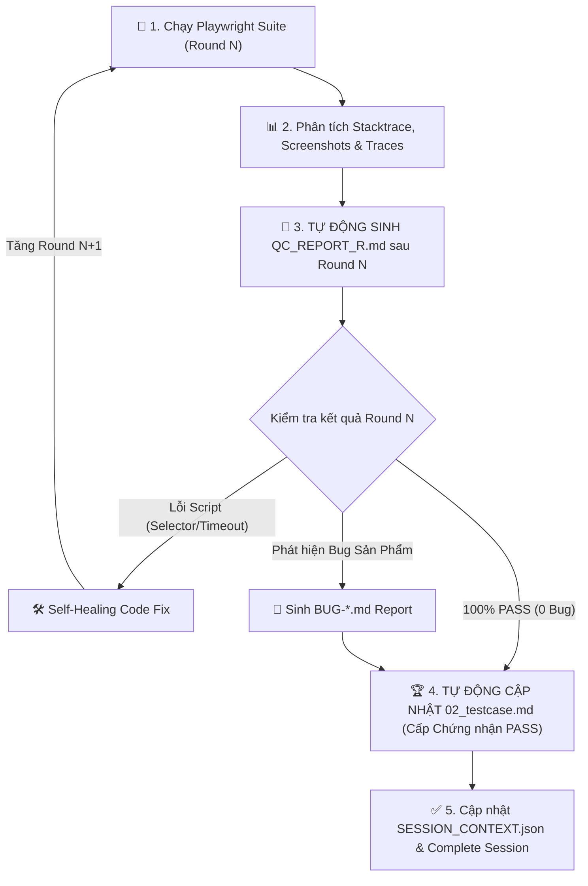

# 🚀 AI Playwright Test Runner — Self-Healing Execution & Test Case Auto-Update Engine (v2.1)

Skill này thực thi Playwright test, tự sửa lỗi script, **TẠO REPORT CHI TIẾT SAU MỖI ROUND TEST**, **TỰ ĐỘNG CẬP NHẬT FILE TESTCASE (đánh dấu PASS/FAIL và cấp Chứng nhận QC khi 0 bug)** và báo cáo bug sản phẩm thực sự. Multi-Agent Safe — mỗi session lưu kết quả riêng biệt.

---

## 🔄 BƯỚC 0: NHẬN SESSION & XÁC NHẬN THÔNG TIN

### Nhận SESSION_ID:
- **Từ Orchestrator**: Dùng SESSION_ID được truyền vào.
- **Standalone**: Tự sinh `SES_<YYYYMMDD>_<HHmmss>_TEST_RUN`.

### Đọc `pipeline.config.json` — CHỈ ĐỌC:
- Lấy: `paths.e2eFeaturesDir`, `paths.bugReportDir`, `paths.sessionRegistryDir`, `paths.testcaseOutputDir`
- Lấy: `testRunner.maxSuiteReruns`, `testRunner.maxSelfHealPerFile`, `testRunner.browser`, `testRunner.baseUrl`

### Hỏi xác nhận nếu cần:
```
🚀 [TEST RUNNER CONFIRMATION]

1. File test cần chạy:
   → A) Lấy từ session hiện tại: <SESSION_ID>/03_playwright/*.spec.ts
   → B) Chỉ định file cụ thể: ___

2. Môi trường chạy test:
   → A) Local: http://localhost:<port>
   → B) Staging: https://staging.yourapp.com
   → C) Khác: ___

3. Browser:
   → A) chromium (mặc định)
   → B) firefox
   → C) webkit (Safari)

4. Chế độ:
   → A) Headless (không hiện browser — nhanh hơn)
   → B) Headed (hiện browser — dễ debug)
```

---

## ⚡ QUY TRÌNH THỰC THI, SELF-HEALING & CẬP NHẬT TESTCASE (5 BƯỚC)



---

### Bước 1: Thực thi Playwright Suite (Round N)
```bash
# Lệnh chạy chuẩn
PLAYWRIGHT_BASE_URL=<baseUrl> npx playwright test \
  <e2eFeaturesDir>/<FEATURE_ID>/<FeatureName>.spec.ts \
  --project=<browser> \
  --reporter=html,list
```
- Khởi tạo `roundCount = 1` (trong bộ nhớ — KHÔNG ghi vào config)

---

### Bước 2: Phân loại Lỗi & Self-Diagnosis

```
Khi có test fail, AI đọc:
├── Stacktrace: Xác định dòng code lỗi
├── Error message: Phân loại lỗi
├── Screenshot: Xem trạng thái UI tại thời điểm fail
└── Trace file (.zip): Xem từng bước thực hiện

Phân loại:
┌─────────────────────────────────────────────────────┐
│ LOẠI 1 — Lỗi Mã Test (Script Defect)                 │
│ → Selector sai/lỗi thời               → SELF-HEAL   │
│ → Timeout (element chưa xuất hiện)    → SELF-HEAL   │
│ → Modal/Overlay chặn click            → SELF-HEAL   │
│ → Auth token hết hạn                  → SELF-HEAL   │
│ → Missing await                       → SELF-HEAL   │
├─────────────────────────────────────────────────────┤
│ LOẠI 2 — Lỗi Sản phẩm (Real Product Bug)            │
│ → API trả về 500/503                  → BUG REPORT  │
│ → UI hiển thị sai với tài liệu        → BUG REPORT  │
│ → Dữ liệu không được lưu vào DB       → BUG REPORT  │
│ → Logic nghiệp vụ sai                 → BUG REPORT  │
└─────────────────────────────────────────────────────┘
```

---

### Bước 3: TỰ ĐỘNG TẠO FILE REPORT SAU MỖI ROUND TEST (`QC_REPORT_R<N>.md`)

> [!IMPORTANT]
> **BẮT BUỘC:** Sau mỗi round test (cho dù Pass hay Fail), AI **phải tạo/cập nhật ngay** file báo cáo `<SESSION_ID>/04_test_results/QC_REPORT_R<N>.md`.

#### Template Báo cáo Round Test (`QC_REPORT_R<N>.md`):
```markdown
# 📊 QC TEST REPORT — ROUND <N>

## 1. Thông tin Tổng quan
- **Session ID**: `<SESSION_ID>`
- **Tính năng**: `<FeatureName>`
- **Thời gian thực thi**: `<ISO timestamp>`
- **Môi trường (Base URL)**: `<baseUrl>`
- **Trình duyệt**: `<browser>`
- **Trạng thái Round**: `[PASS_100% | COMPLETED_WITH_BUGS | IN_PROGRESS_SELF_HEALING]`

## 2. Kết quả Thống kê Round <N>
| Chỉ số | Số lượng | Tỷ lệ (%) |
|---|---|---|
| **Tổng số Testcase** | `<TOTAL>` | 100% |
| **Testcase PASS** | `<PASS>` | `<PASS_PERCENT>%` |
| **Lỗi mã test (Đã Self-Heal)** | `<HEALED>` | `<HEALED_PERCENT>%` |
| **Lỗi sản phẩm (Bug thực sự)** | `<BUGS>` | `<BUG_PERCENT>%` |

## 3. Danh sách Kết quả Chi tiết từng Testcase
| STT | Mã Testcase | Tên Testcase | Trạng thái | Thời gian (s) | Ghi chú & Trace |
|---|---|---|---|---|---|
| 1 | `TC_01` | Tạo đơn hàng thành công | ✅ PASS | 2.4s | - |
| 2 | `TC_02` | Validate email không hợp lệ | ✅ PASS | 1.8s | Self-healed selector in Round 1 |
| 3 | `TC_03` | Phê duyệt đơn hàng cấp cao | ❌ FAIL (BUG) | 3.2s | Tham chiếu [BUG-001.md](./BUG-001.md) |

## 4. Nhật ký Self-Healing trong Round này (nếu có)
- **File đã sửa**: `e2e/pages/<FeatureName>Page.ts`
- **Thay đổi**: Sửa locator `getByRole('button', { name: 'Lưu' })` thay cho `.btn-save`
- **Lý do**: Element `.btn-save` không phản hồi trong 30000ms.

## 5. Kết luận Round <N>
- **Trạng thái**: `<PASS_100% / CÓ BUG / CẦN RE-RUN ROUND N+1>`
- **Ghi chú**: `<Mô tả ngắn>`
```

---

### Bước 4: TỰ ĐỘNG CẬP NHẬT FILE TEST CASE (`02_testcase.md`)

> [!IMPORTANT]
> **CƠ CHẾ CẬP NHẬT TESTCASE TỰ ĐỘNG:**
> Cho dù các Round test **CHƯA PHÁT HIỆN BUG (100% PASS)** hay **CÓ BUG**, AI **BẮT BUỘC phải cập nhật trực tiếp** file `<SESSION_ID>/02_testcase.md` (và đồng bộ về `paths.testcaseOutputDir`).

#### 🟢 Tình huống 1: CHƯA PHÁT HIỆN BUG (100% PASS)
AI thực hiện:
1. Chèn block **🏆 QC EXECUTION CERTIFICATION** vào đầu file `<SESSION_ID>/02_testcase.md`:
   ```markdown
   > **🏆 QC EXECUTION CERTIFIED — 100% PASS (0 BUGS FOUND)**
   > - **Trạng thái kiểm thử**: ✅ PASSED 100%
   > - **Số Round đã thực thi**: <N> rounds
   > - **Thời điểm chứng nhận**: <ISO timestamp>
   > - **Báo cáo chi tiết Round cuối**: [QC_REPORT_R<N>.md](./04_test_results/QC_REPORT_R<N>.md)
   ```
2. Cập nhật dòng trạng thái từng testcase trong file `02_testcase.md`:
   - Từ: `### TC_01: Tạo đơn hàng`
   - Thành: `### TC_01: Tạo đơn hàng [STATUS: ✅ PASS | Verified: Round <N>]`

#### 🔴 Tình huống 2: CÓ PHÁT HIỆN BUG
AI thực hiện:
1. Chèn block **⚠️ QC EXECUTION REPORT — BUGS DETECTED** vào đầu file `<SESSION_ID>/02_testcase.md`:
   ```markdown
   > **⚠️ QC EXECUTION REPORT — BUGS DETECTED**
   > - **Trạng thái kiểm thử**: ❌ PARTIAL FAIL (<N_BUG> bugs phát hiện)
   > - **Danh sách Bug**: [BUG-001.md](./04_test_results/BUG-001.md)
   ```
2. Cập nhật từng testcase bị fail trong file `02_testcase.md`:
   - Thành: `### TC_03: Phê duyệt đơn hàng [STATUS: ❌ FAIL | Ref: BUG-001.md]`

---

### Bước 5: Self-Healing Loop & Hard Cap Safety

> [!CAUTION]
> **HARD CAP — Giới hạn an toàn tuyệt đối:**
> - Tối đa `maxSelfHealPerFile` lần sửa/file (mặc định: 3)
> - Tối đa `maxSuiteReruns` lần Re-Run suite (mặc định: 5)
> - Khi đạt giới hạn: DỪNG và xuất báo cáo `QC_REPORT_R<N>.md` với trạng thái `PARTIAL_FAIL_HARD_CAP`.

---

## 💾 OUTPUT (SESSION-SCOPED)

1. `<SESSION_ID>/04_test_results/QC_REPORT_R<N>.md` — File report chi tiết sau **MỖI** Round test.
2. `<SESSION_ID>/02_testcase.md` — File testcase **ĐÃ ĐƯỢC CẬP NHẬT TRẠNG THÁI & CẤP CHỨNG NHẬN PASS / FAIL**.
3. `<SESSION_ID>/04_test_results/BUG-<MODULE>-<ID>.md` — Bug reports (nếu có lỗi sản phẩm).
4. `<SESSION_ID>/04_test_results/traces/` — Playwright traces & screenshots.

### Cập nhật SESSION_CONTEXT.json:
```json
{
  "step": "playwright-test-runner",
  "status": "COMPLETED",
  "result": "PASS_100%" | "PARTIAL_FAIL_HARD_CAP",
  "totalTests": N,
  "passedTests": M,
  "failedTests": K,
  "suiteRerunCount": X,
  "lastReportFile": "<SESSION_ID>/04_test_results/QC_REPORT_R<N>.md",
  "updatedTestcaseFile": "<SESSION_ID>/02_testcase.md",
  "bugReports": ["<SESSION_ID>/04_test_results/BUG-*.md"],
  "completedAt": "<ISO timestamp>"
}
```
Cập nhật REGISTRY.json: Di chuyển session `activeSessions` → `completedSessions`. **KHÔNG ghi vào config chung.**
