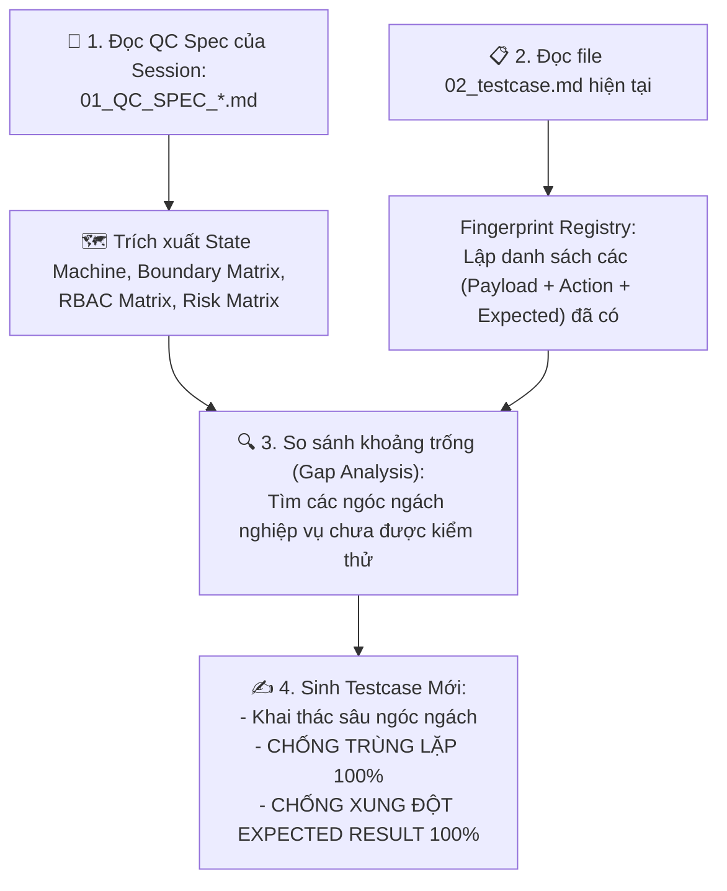

# 🧪 AI Testcase Generator — Continuous Deep Expansion & Deduplication Engine (v2.9)

Skill này bóc tách và mở rộng bộ testcase chuyên sâu từ bản QC Spec. **CAM KẾT ĐỌC TỰ ĐỘNG QC SPEC THEO SESSION, TỰ ĐỘNG ĐỐI CHIẾU DỮ LIỆU ĐÃ CÓ ĐỂ KHAI THÁC MỌI NGÓC NGÁCH NGHIỆP VỤ, CHỐNG TRÙNG LẶP VÀ CHỐNG XUNG ĐỘT KẾT QUẢ MONG ĐỢI 100%.**

---

## 🔍 GIAO THỨC BỔ SUNG NGÓC NGÁCH NGHIỆP VỤ & CHỐNG TRÙNG LẶP (DEEP EXPANSION & DEDUPLICATION PROTOCOL)

Khi được yêu cầu tạo mới hoặc bổ sung testcase cho một Session (`SESSION_ID`), AI Agent **BẮT BUỘC** thực thi 4 bước kiểm soát nghiêm ngặt sau:

---

### 1. 📖 Tự Động Đọc Và Nạp Tri Thức QC Spec Theo Session (`01_QC_SPEC_*.md`):
- AI Agent tự động đọc file `<SESSION_ID>/01_QC_SPEC_*.md`.
- Nạp State Machine, Field Validation, RBAC Matrix, Risk Matrix.

---

### 2. 📋 Đọc File Testcase Hiện Tại (`02_testcase.md`) & Lập Fingerprint Registry:
- Trích xuất danh sách `(Mã TC | Role | Action Input Payload | Expected Result State)` của tất cả testcase đã tồn tại để tránh trùng lặp.

---

### 3. 🔍 Khai Thác Sâu Các Ngóc Ngách Nghiệp Vụ Chưa Phủ (Deep Penetration Edge Cases):
- **Tổ hợp chéo rủi ro cao**: Phụ lục + Docx lỗi font + KH CM ngưng hoạt động + Nhóm dịch vụ không hỗ trợ template + Account bị lock...
- **Thao tác dị biệt (Adversarial Actions)**: Double click 50ms, IDOR URL modification, Max payload 100MB, Network disconnect...

---

### 4. 🛡️ CHỐNG TRÙNG LẶP & CHỐNG XUNG ĐỘT KẾT QUẢ MONG ĐỢI 100%:
- **Zero Duplication**: Không trùng lặp cặp `(Input Payload + Action Steps)`.
- **Expected State Harmony**: Tuân thủ 100% State Machine trong QC Spec. Không có xung đột giữa TC mới và TC cũ.

---

## 🚫 CẤU TRÚC 100% CHI TIẾT ĐẦY ĐỦ 4 PHẦN (STRICT NO-COMPRESSION v2.9)
Tất cả các testcase bổ sung **BẮT BUỘC** giữ nguyên độ chi tiết 4 phần như ban đầu (Ưu tiên, Điều kiện/Data payload, Các bước 1..N chi tiết, Expected Result DB/API).
