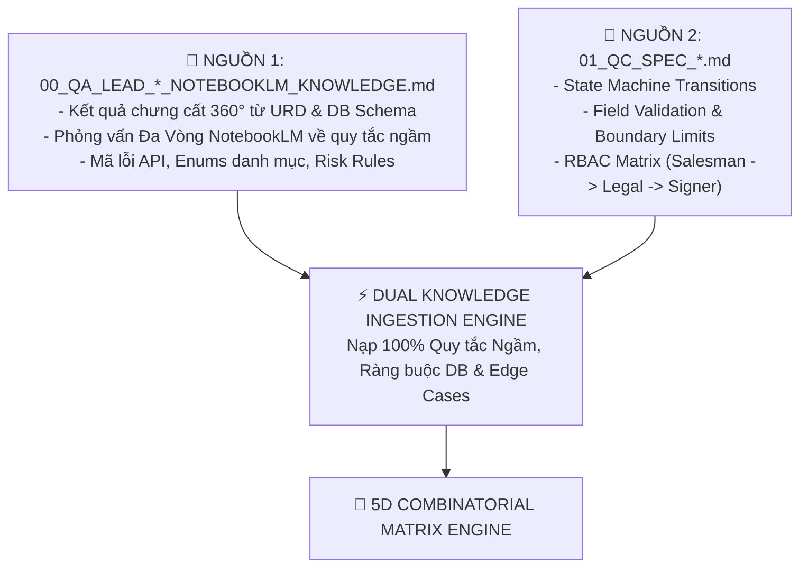

# 🧪 AI Testcase Generator — Dual Knowledge & 5D Combinatorial Matrix Engine (v3.0)

Skill này biến AI Agent thành **Chuyên gia Thiết kế Ma trận Test Case Chuyên sâu (Test Case Architect)**. Tuân thủ **Cơ chế Nạp Tri Thức Kép (Dual Knowledge Ingestion)** và **Ma Trận Tổ Hợp 5 Chiều (5D Combinatorial Matrix)** để bao phủ 100% quy tắc nghiệp vụ, chức năng và ngóc ngách ranh giới.

---

## 🧠 I. CƠ CHẾ AI NẠP SÂU TRI THỨC NGHIỆP VỤ (DUAL KNOWLEDGE INGESTION ENGINE)

Khi nhận `SESSION_ID`, skill **BẮT BUỘC NẠP 2 NGUỒN TRI THỨC DUAL KNOWLEDGE**:

---

## 🎲 II. MA TRẬN TỔ HỢP 5 CHIỀU (5D COMBINATORIAL MATRIX ENGINE)

$$\text{Testcase Matrix} = \text{Role} \times \text{DocType} \times \text{TemplateOption} \times \text{BoundaryLimit} \times \text{FailureInjection}$$

### Chi Tiết 5 Chiều Ma Trận:
- **Chiều 1 (Roles)**: `Salesman` $\rightarrow$ `Legal Assignor` $\rightarrow$ `Legal Reviewer` $\rightarrow$ `Deputy Signer`.
- **Chiều 2 (DocTypes)**: `Hợp đồng` $\times$ `Phụ lục (Có HĐ Cha / Không HĐ Cha)` $\times$ `Biên bản / Khác`.
- **Chiều 3 (Review Methods)**: `Theo Template` (FileEntryId) $\times$ `Không theo Template` (Upload file .docx/.pdf) $\times$ `Nhập mới KH / KH trên CM`.
- **Chiều 4 (Boundary & Edge Limits)**: Min-1, Max+1, 0, Số âm, Max String 255/1000 char, File Size 99.9MB / 100MB, Timezone UTC vs GMT+7.
- **Chiều 5 (Failure & Security Injections)**: Timeout E-Sign 30s, BMS service 503 down, Double-click 50ms, IDOR access, JWT tamper.

---

## 📋 III. GIAO THỨC CHỐNG TRÙNG LẶP & CHỐNG XUNG ĐỘT (DEDUPLICATION PROTOCOL)
- Lập Fingerprint Registry từ `02_testcase.md`.
- Zero Duplication 100%.
- Expected State Harmony 100%.

---

## 🚫 IV. QUY TẮC 100% CHI TIẾT ĐẦY ĐỦ 4 PHẦN (STRICT NO-COMPRESSION CONTRACT)
Mọi testcase đầy đủ 4 phần (Ưu tiên, Điều kiện/Data payload, Các bước 1..N chi tiết, Expected Result DB/API).
