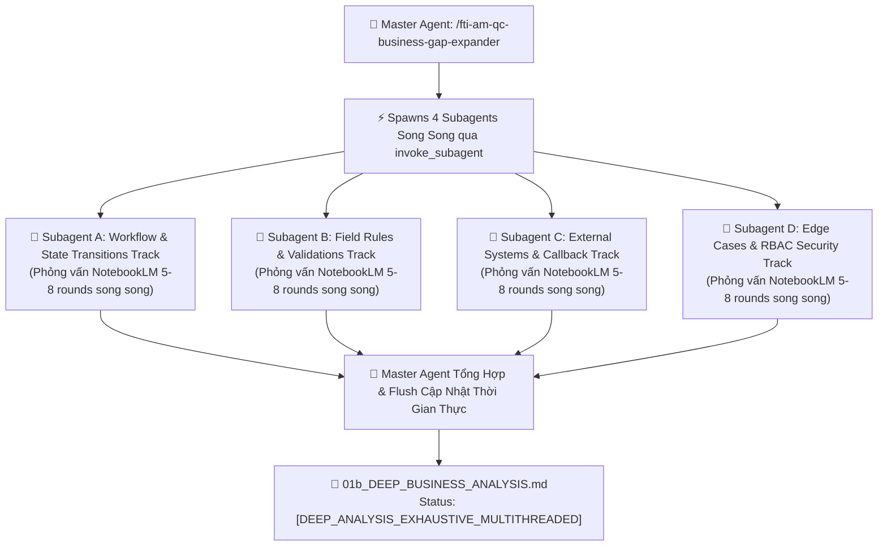

# ⚡ FTI-AM QC Business Gap Expander — Concurrent Multi-Agent Discovery Engine (v2.0)

Skill này chịu trách nhiệm **Rà soát Chống Bỏ Sót Nghiệp Vụ & Khai Quật Quy Tắc Thiếu Ở Quy Mô Đa Luồng (Concurrent Multi-Agent Business Gap Discovery)**. Skill sử dụng công cụ `invoke_subagent` để **khởi chạy 3-4 Subagents chạy song song**, chia nhỏ mảng nghiệp vụ để phỏng vấn Google NotebookLM (`fti-am-notebooklm-query`) đa vòng đồng thời (tổng cộng 10-20+ rounds, 30-50+ câu hỏi chuyên sâu song song), lấp đầy 100% quy tắc bị thiếu vào `01b_DEEP_BUSINESS_ANALYSIS.md`.

---

## 🚀 I. KIẾN TRÚC ĐA LUỒNG SUBAGENTS SONG SONG (CONCURRENT SUBAGENTS ENGINE)



---

## ⚡ II. NGUYÊN TẮC PHÂN CHIA LUỒNG KHI KHỞI CHẠY `INVOKE_SUBAGENT`

Khi kích hoạt, Master Agent sử dụng `invoke_subagent` chia công việc thành 4 Subagents độc lập:

1. **Subagent Track A — Workflow & State Transitions**:
   - Chuyên phỏng vấn NotebookLM 5-8 rounds về các luồng Happy path, Alternate path, ma trận chuyển trạng thái DB Oracle CTI, luồng Hủy/Từ chối.
2. **Subagent Track B — Field Validations & Business Constraints**:
   - Chuyên phỏng vấn NotebookLM 5-8 rounds về chi tiết quy tắc validation từng trường dữ liệu, regex, min/max length, mã số thuế CM, logic auto-fill.
3. **Subagent Track C — External Integrations & Callback Chaos**:
   - Chuyên phỏng vấn NotebookLM 5-8 rounds về FPT.eSign, BMS post-binding callbacks, FTI-CM lookup, MinIO storage timeouts.
4. **Subagent Track D — Edge Cases & RBAC Security**:
   - Chuyên phỏng vấn NotebookLM 5-8 rounds về IDOR bypass role, double submit race condition, buffer overflow Notes field, ranh giới số lượng/thời gian.

---

## 📑 III. QUY TRÌNH 4 BƯỚC THỰC THI ĐA LUỒNG

1. **Bước 1: Master Agent đọc file `01b_DEEP_BUSINESS_ANALYSIS.md`**: Lập danh mục các mảng nghiệp vụ hiện có.
2. **Bước 2: Dispatch 4 Subagents song song**: Gọi `invoke_subagent` với 4 prompt giao nhiệm vụ độc lập cho 4 subagents.
3. **Bước 3: Các Subagents chạy phỏng vấn NotebookLM song song**:
   - Mỗi Subagent chạy 5-8 rounds phỏng vấn với NotebookLM (`fti-am-notebooklm-query`), đặt 5-7 câu hỏi chuyên sâu/round (tổng cộng 30-50+ câu hỏi song song).
4. **Bước 4: Master Agent Tổng hợp & Cập nhật thời gian thực vào file**:
   - Ngay khi nhận kết quả từ từng Subagent ➔ **CẬP NHẬT GHI NGAY VÀO FILE `am-docs/QC_SESSIONS/<SESSION_ID>/01b_DEEP_BUSINESS_ANALYSIS.md`**.

---

## 📑 IV. HEADER METADATA SAU KHÍ HOÀN THÀNH SKILL ĐA LUỒNG

```markdown
# 👔 BÁO CÁO PHÂN TÍCH NGHIỆP VỤ CHUYÊN SÂU ĐA LUỒNG (MULTITHREADED EXHAUSTIVE SPEC)

- **Mã Session**: `<SESSION_ID>`
- **Động Cơ Thực Thi**: `Concurrent Multi-Agent Subagent Engine (4 Track Parallel Subagents)`
- **Nguồn Tri Thức Thẩm Định**: `Google NotebookLM (fti-am-notebooklm-query)`
- **Tổng Số Round Phỏng Vấn Song Song**: `<N> Rounds (40-60+ câu hỏi chuyên sâu)`
- **Mức Độ Đầy ĐỦ**: `100% Exhaustive & Zero-Gap (Multi-Track Verified)`
- **Trạng Thái**: `[DEEP_ANALYSIS_EXHAUSTIVE_MULTITHREADED]`
```
