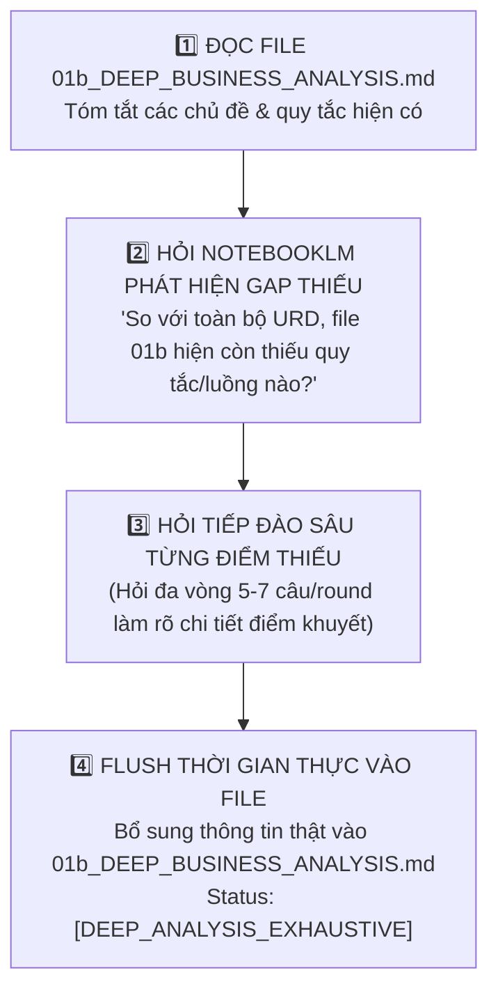

# 🔎 FTI-AM QC Business Gap Expander — Progressive Business Gap Discovery Skill (v1.0)

Skill này chịu trách nhiệm **Rà soát Chống Bỏ Sót Nghiệp Vụ & Khai Quật Quy Tắc Thiếu (Progressive Business Gap Discovery)**. Skill đọc file `01b_DEEP_BUSINESS_ANALYSIS.md`, liên tục phỏng vấn Google NotebookLM (`fti-am-notebooklm-query`) để săn tìm các quy tắc/luồng còn thiếu so với URD gốc, sau đó đào sâu từng điểm thiếu và cập nhật thời gian thực để làm đầy 100% nội dung nghiệp vụ.

---

## 🎯 I. MỤC TIÊU & SỰ KHÁC BIỆT CỐT LÕI (CORE MISSION & DIFFERENCES)

> [!NOTE]
> - **Khác với `fti-am-qc-business-verifier`**: Verifier chuyên về cắt tỉa rule tự bịa.
> - **Nhiệm vụ của `fti-am-qc-business-gap-expander`**: Tập trung 100% vào việc **CHỐNG BỎ SÓT NGHIỆP VỤ**. Rà soát file `01b_DEEP_BUSINESS_ANALYSIS.md`, hỏi NotebookLM chỉ ra những phần còn khuyết/thiếu, sau đó **HỎI TIẾP CÁC CÂU HỎI ĐÀO SÂU** để làm rõ dứt điểm các luồng bị thiếu và lưu trực tiếp vào file.

---

## ⚡ II. QUY TRÌNH 4 BƯỚC KHAI QUẬT LẤP ĐẦY NGHIỆP VỤ THIẾU (GAP DISCOVERY PROTOCOL)



---

### 🔹 Bước 1: Rà Soát Nội Dung File Hiện Tại (Current Content Audit)
AI đọc file `am-docs/QC_SESSIONS/<SESSION_ID>/01b_DEEP_BUSINESS_ANALYSIS.md`, lập danh mục các mảng nghiệp vụ đã được liệt kê (Workflow, Field Rules, DB States, RBAC...).

### 🔹 Bước 2: Phỏng Vấn NotebookLM Nhận Diện Quy Tắc Còn Thiếu (Gap Discovery Query)
AI gọi `fti-am-notebooklm-query` đặt câu hỏi tổng lực để NotebookLM rà soát đối chiếu với toàn bộ URD gốc:
> *"Tôi đang có bản phân tích nghiệp vụ cho tính năng [TÊN_TÍNH_NĂNG] gồm các phần: [Danh mục Bước 1]. Dựa trên toàn bộ tài liệu URD gốc, hãy liệt kê 100% tất cả các luồng nghiệp vụ, điều kiện biên, ràng buộc dữ liệu hoặc ngoại lệ nào VẪN CÒN THIẾU hoặc CHƯA ĐƯỢC ĐỀ CẬP trong bản phân tích này?"*

### 🔹 Bước 3: Đào Sâu Làm Rõ Chi Tiết Từng Điểm Thiếu (Progressive Deep-Dive Querying)
Ngay khi NotebookLM phản hồi danh sách các nghiệp vụ còn thiếu (ví dụ: khuyết luồng Hủy phiếu khi đang ký E-Sign, khuyết validation MST 13 số NCC, khuyết cờ logic BMS Callback...), AI **TỰ ĐỘNG LẬP CÁC ROUND HỎI TIẾP THEO (5 - 7 câu hỏi/round)** để đào sâu từng điểm thiếu đó:
- *"Đối với luồng [Điểm thiếu A], các bước thao tác cụ thể là gì?"*
- *"Quy tắc validation cho [Field B bị thiếu] quy định chính xác regex và thông báo lỗi như thế nào?"*
- *"Điều kiện để kích hoạt [Trạng thái C bị khuyết] là gì?"*

### 🔹 Bước 4: Cập Nhật Thời Gian Thực Vào File `01b_DEEP_BUSINESS_ANALYSIS.md` (Incremental Flush)
Sau mỗi Round đào sâu thông tin thật từ NotebookLM, AI **CẬP NHẬT GHI NGAY VÀO FILE `01b_DEEP_BUSINESS_ANALYSIS.md`** tại các mục tương ứng hoặc mở rộng thêm phần:

```markdown
## ➕ Phần 7: Các Quy Tắc Nghiệp Vụ Đã Khai Quật & Lấp Đầy (Discovered Business Gaps & Full Specifications)
- (Cập nhật chi tiết 100% thông tin thật từ NotebookLM)
```

---

## 📑 III. HEADER METADATA SAU KHÍ HOÀN THÀNH SKILL

```markdown
# 👔 BÁO CÁO PHÂN TÍCH NGHIỆP VỤ CHUYÊN SÂU & ĐẦY ĐỦ 100% (EXHAUSTIVE BUSINESS ANALYSIS)

- **Mã Session**: `<SESSION_ID>`
- **Nguồn Tri Thức Thẩm Định**: `Google NotebookLM (fti-am-notebooklm-query)`
- **Số Điểm Khuyết Đã Khai Quật & Bổ Sung**: `<N> Business Gaps`
- **Mức Độ Đầy Đủ Nghiệp Vụ**: `100% (Exhaustive & Zero-Gap)`
- **Trạng Thái**: `[DEEP_ANALYSIS_EXHAUSTIVE]`
```
