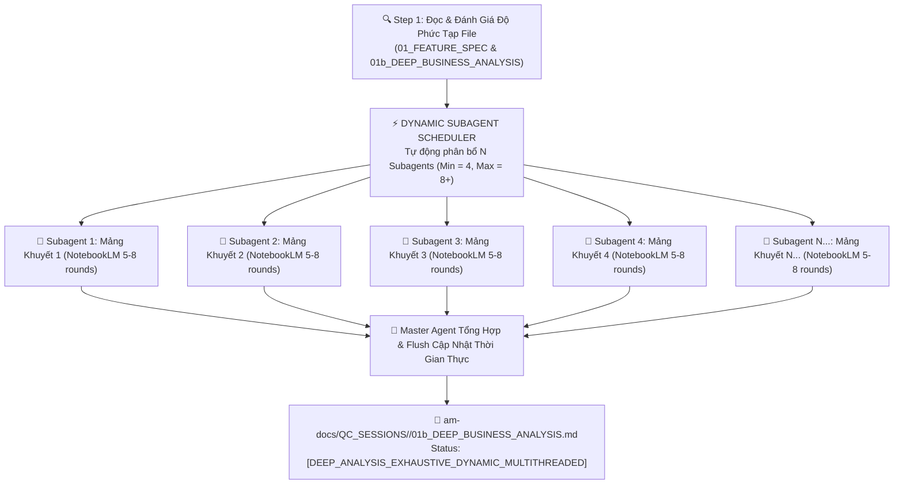

# ⚡ FTI-AM QC Business Gap Expander — Dynamic Multi-Agent Discovery Engine (v3.0)

Skill này chịu trách nhiệm **Rà soát Chống Bỏ Sót Nghiệp Vụ & Khai Quật Quy Tắc Thiếu Ở Quy Mô Đa Luồng Động (Dynamic Context-Aware Multi-Agent Discovery)**. AI ban đầu đọc file `01_FEATURE_REQUIREMENTS_SPEC.md` và `01b_DEEP_BUSINESS_ANALYSIS.md`, phân tích nội dung và đánh giá độ phức tạp để **TỰ ĐỘNG PHÂN BỔ ĐỘNG SỐ LƯỢNG SUBAGENTS (Tối thiểu 4 Subagents, tự động tăng lên 5, 6, 8+ Subagents nếu tính năng nhiều ngóc ngách)**, sau đó khởi chạy song song qua `invoke_subagent` phỏng vấn Google NotebookLM (`fti-am-notebooklm-query`) đa vòng lấp đầy 100% quy tắc bị thiếu.

---

## 🚀 I. ĐỘNG CƠ PHÂN BỔ SUBAGENTS ĐỘNG THEO NGỮ CẢNH (DYNAMIC SUBAGENT SCHEDULER)

> [!IMPORTANT]
> **KHÔNG CỐ ĐỊNH TĨNH — PHÂN BỔ ĐỘNG THEO NỘI DUNG VÀ ĐỘ PHỨC TẠP:**
> Master Agent **KHÔNG HARDCODE** danh sách Subagents cố định. Thay vào đó, AI đọc file báo cáo, bóc tách các mảng nghiệp vụ bị khuyết và tự quyết định:
> - **Mức độ Đơn giản / Tiêu chuẩn**: Phân bổ **4 Subagents song song** (Tối thiểu).
> - **Mức độ Phức tạp / Đa mảng / Đa tích hợp (E-Sign, BMS, CM, Multi-partner KH/NCC)**: AI tự động **TĂNG SỐ LƯỢNG SUBAGENTS LÊN 5, 6, 8+ Subagents song song** tùy theo số lượng mảng khuyết bóc tách được!



---

## ⚡ II. QUY TRÌNH 4 BƯỚC PHÂN BỔ & THỰC THI ĐỘNG

1. **Bước 1 — Bóc tách & Đánh giá Ngữ cảnh (Context & Complexity Audit)**:
   - Master Agent đọc file `01_FEATURE_REQUIREMENTS_SPEC.md` và `01b_DEEP_BUSINESS_ANALYSIS.md`.
   - Đánh giá các mảng nghiệp vụ chưa được khai quật hết: Workflow & States, Field Rules, External Integrations, RBAC Security, Edge Cases, Data Constraints...

2. **Bước 2 — Quyết định Số lượng & Giao Nhiệm vụ Động (Dynamic Scheduler)**:
   - Phân tích số mảng cần khai quật. Nếu có 6 mảng lớn ➔ Khởi tạo **6 Subagents song song**.
   - Đặt tên Role và tạo Prompt nhiệm vụ cụ thể cho từng Subagent dựa trên kết quả phân tích file thực tế.

3. **Bước 3 — Khởi chạy Đa luồng qua `invoke_subagent`**:
   - Gọi `invoke_subagent` khởi chạy đồng thời N Subagents (4 đến 8+ Subagents).
   - Mỗi Subagent phỏng vấn 5-8 rounds với NotebookLM (`fti-am-notebooklm-query`) đa vòng chuyên sâu (tổng cộng 30-60+ câu hỏi song song).

4. **Bước 4 — Tổng hợp & Cập nhật thời gian thực vào file (Incremental Flush)**:
   - Ngay khi các Subagents hoàn thành ➔ Master Agent tổng hợp các quy tắc bị thiếu được lấp đầy và **GHI NGAY VÀO FILE `am-docs/QC_SESSIONS/<SESSION_ID>/01b_DEEP_BUSINESS_ANALYSIS.md`**.

---

## 📑 III. HEADER METADATA SAU KHI HOÀN THÀNH SKILL

```markdown
# 👔 BÁO CÁO PHÂN TÍCH NGHIỆP VỤ ĐẦY ĐỦ 100% ĐA LUỒNG ĐỘNG (DYNAMIC DUAL-SPEC)

- **Mã Session**: `<SESSION_ID>`
- **Động Cơ Thực Thi**: `Dynamic Multi-Agent Subagent Engine (<N> Parallel Subagents Allocated)`
- **Nguồn Tri Thức Thẩm Định**: `Google NotebookLM (fti-am-notebooklm-query)`
- **Tổng Số Subagents Đã Điều Phối**: `<N> Subagents (Tối thiểu 4)`
- **Tổng Số Round Phỏng Vấn Song Song**: `<X> Rounds (<Y> câu hỏi chuyên sâu)`
- **Mức Độ Đầy Đủ**: `100% Exhaustive & Zero-Gap (Dynamic Multi-Track Verified)`
- **Trạng Thái**: `[DEEP_ANALYSIS_EXHAUSTIVE_DYNAMIC_MULTITHREADED]`
```
