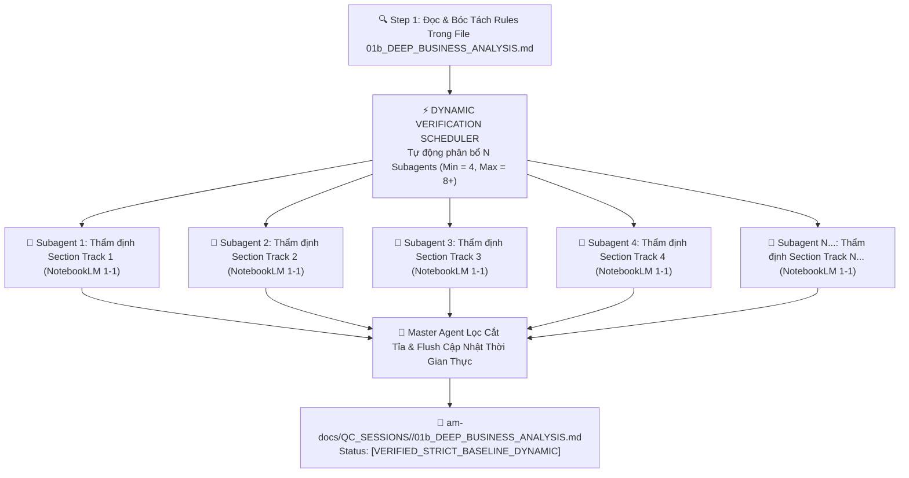

# 🔍 FTI-AM QC Business Verifier — Dynamic Multi-Agent Verification Engine (v3.0)

Skill này chịu trách nhiệm **Thẩm định & Kiểm chứng Nghiệp vụ 100% Không Hallucination Ở Quy Mô Đa Luồng Động (Dynamic Context-Aware Verification)**. Master Agent ban đầu đọc file `01b_DEEP_BUSINESS_ANALYSIS.md`, phân tích khối lượng quy tắc và **TỰ ĐỘNG PHÂN BỔ ĐỘNG SỐ LƯỢNG SUBAGENTS (Tối thiểu 4 Subagents, tự động tăng lên 5, 6, 8+ Subagents nếu file chứa nhiều section/quy tắc phức tạp)**, khởi chạy song song qua `invoke_subagent` đối chiếu 1-1 với Google NotebookLM (`fti-am-notebooklm-query`) loại bỏ 100% quy tắc tự bịa.

---

## 🚀 I. ĐỘNG CƠ PHÂN BỔ SUBAGENTS THẨM ĐỊNH ĐỘNG

> [!IMPORTANT]
> **PHÂN BỔ ĐỘNG THEO KHỐI LƯỢNG RULES TRONG FILE:**
> Master Agent bóc tách danh sách các Section & Quy tắc trong file `01b_DEEP_BUSINESS_ANALYSIS.md`. Dựa vào số lượng section và mức độ phức tạp, AI tự phân bổ:
> - **Tối thiểu**: **4 Subagents song song** cho các file đặc tả tiêu chuẩn.
> - **Mở rộng**: **5, 6, 8+ Subagents song song** nếu file chứa hàng trăm quy tắc phức tạp ở nhiều mảng khác nhau.

---

## ⚡ II. QUY TRÌNH THỰC THI ĐA LUỒNG ĐỘNG

1. **Master Agent đọc & phân tích file `01b_DEEP_BUSINESS_ANALYSIS.md`**: Trích xuất toàn bộ danh mục rules.
2. **Quyết định số lượng Subagents (Min 4, Max 8+)**: Phân chia danh mục rules cho N Subagents song song.
3. **Dispatch Subagents qua `invoke_subagent`**: Khởi chạy đồng thời N Subagents phỏng vấn đối chiếu 1-1 với NotebookLM (`fti-am-notebooklm-query`).
4. **Lọc cắt tỉa & tổng hợp**:
   - **NotebookLM xác nhận CÓ**: Giữ lại rule `[✅ VERIFIED]`.
   - **NotebookLM xác nhận KHÔNG CÓ (tự bịa)**: Xóa 100% `[❌ SANITIZED_HALLUCINATION]`.
5. **Master Agent Cập nhật thời gian thực vào file `01b_DEEP_BUSINESS_ANALYSIS.md`**.
