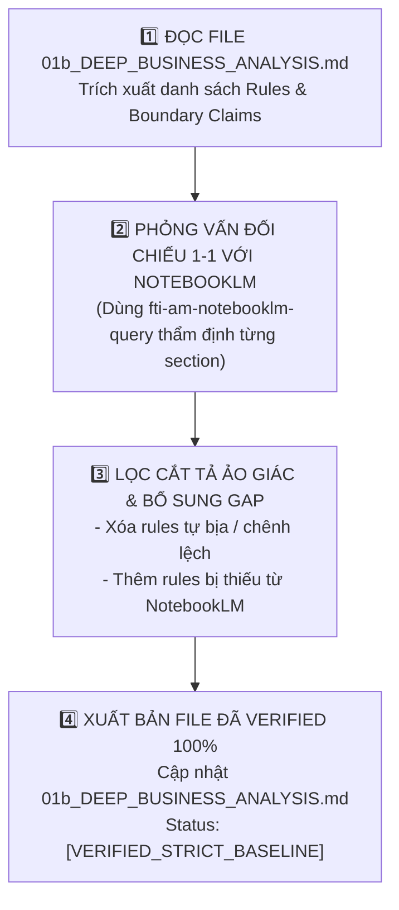

# 🔍 FTI-AM QC Business Verifier — Strict Business Domain Verifier & Hallucination Sanitizer (v1.0)

Skill này chịu trách nhiệm **Thẩm định & Kiểm chứng Nghiệp vụ 100% Không Hallucination**, rà soát từng dòng quy tắc trong `01b_DEEP_BUSINESS_ANALYSIS.md`, lấy Google NotebookLM (`fti-am-notebooklm-query`) làm **Nguồn Sự Thật Tối Cao (Single Source of Truth)** để cắt tỉa quy tắc tự bịa và bổ sung quy tắc còn thiếu.

---

## 🎯 I. 4 MỤC TIÊU THẨM ĐỊNH CỐT LÕI (CORE VERIFICATION OBJECTIVES)

1. **Loại Bỏ 100% Ảo Giác & Quy Tắc Bịa (Hallucination Sanitization)**: Phát hiện và xóa bỏ toàn bộ các điều kiện, field validation hoặc logic do AI tự suy đoán/bịa ra không có trong nguồn NotebookLM.
2. **Loại Bỏ Thông Tin Chênh Lệch & Dư Thừa (Spec Drift Removal)**: Cắt tỉa các đoạn mô tả dư thừa, chung chung không đúng với URD thực tế.
3. **Bổ Sung Nghiệp Vụ Thiếu (Exhaustive Gap Expansion)**: Phỏng vấn NotebookLM để lấp đầy các luồng ngoại lệ, quy tắc ranh giới còn bị khuyết.
4. **Chuẩn Hóa Trạng Thái `[VERIFIED_STRICT_BASELINE]`**: Cập nhật file báo cáo đạt trạng thái thẩm định nghiêm ngặt sát 100% với tài liệu nghiệp vụ.

---

## ⚡ II. QUY TRÌNH 4 BƯỚC THẨM ĐỊNH CHI TIẾT (VERIFICATION PROTOCOL)



---

### 🔹 Bước 1: Trích Xuất Danh Sách Tuyên Bố Nghiệp Vụ (Rule Extraction)
AI đọc file `am-docs/QC_SESSIONS/<SESSION_ID>/01b_DEEP_BUSINESS_ANALYSIS.md`, bóc tách toàn bộ danh sách quy tắc nghiệp vụ thành các mệnh đề cần thẩm định:
- Bảng Quy tắc Trường Dữ liệu (Field Validations & Regex).
- Ma trận Chuyển trạng thái Ticket (State Machine Transitions).
- Ma trận Phân quyền & Vai trò (RBAC Permissions).
- Bảng Luồng Ngoại Lệ & Rủi Ro (Edge Cases & Failure Risk).

### 🔹 Bước 2: Phỏng Vấn Đối Chiếu 1-1 Với NotebookLM (Cross-Verification Querying)
AI sử dụng `fti-am-notebooklm-query` phỏng vấn NotebookLM từng section để kiểm chứng:
- *"Nguồn URD có quy định [Quy tắc A] không? Đúng hay Sai?"*
- *"Trường [Field B] có bắt buộc nhập và có độ dài tối đa bao nhiêu theo URD chính thức?"*
- *"Trạng thái phiếu [State C] chuyển sang [State D] cần chính xác những điều kiện gì?"*

### 🔹 Bước 3: Lọc Cắt Tỉa Ảo Giác & Mở Rộng Gap Nghiệp Vụ (Sanitization & Expansion)
- **Nếu NotebookLM XÁC NHẬN CÓ**: Giữ lại rule và gắn tag `[✅ VERIFIED]`.
- **Nếu NotebookLM XÁC NHẬN KHÔNG CÓ (AI tự bịa)**: Xóa bỏ 100% khỏi tài liệu và ghi log cắt tỉa `[❌ SANITIZED_HALLUCINATION]`.
- **Nếu phát hiện NotebookLM CÓ QUY ĐỊNH MỚI BỊ THIẾU**: Bổ sung ngay vào tài liệu và gắn tag `[➕ EXPANDED_GAP]`.

### 🔹 Bước 4: Xuất Bản File Thẩm Định Chuẩn (Verified Baseline Output)
AI ghi đè/cập nhật trực tiếp file `am-docs/QC_SESSIONS/<SESSION_ID>/01b_DEEP_BUSINESS_ANALYSIS.md` (hoặc tạo bản sao `01c_VERIFIED_BUSINESS_SPEC.md` nếu người dùng yêu cầu) và gắn Header Metadata chuẩn:

```markdown
# 👔 BÁO CÁO PHÂN TÍCH NGHIỆP VỤ ĐÃ THẨM ĐỊNH 100% (VERIFIED BUSINESS SPEC)

- **Mã Session**: `<SESSION_ID>`
- **Nguồn Tri Thức Thẩm Định**: `Google NotebookLM (fti-am-notebooklm-query)`
- **Tỷ Lệ Thẩm Định**: `100% Verified (0% Hallucination)`
- **Số Rule Đã Cắt Tỉa Bị Bịa**: `<X> rules`
- **Số Rule Mới Đã Mở Rộng**: `<Y> rules`
- **Trạng Thái**: `[VERIFIED_STRICT_BASELINE]`
```
