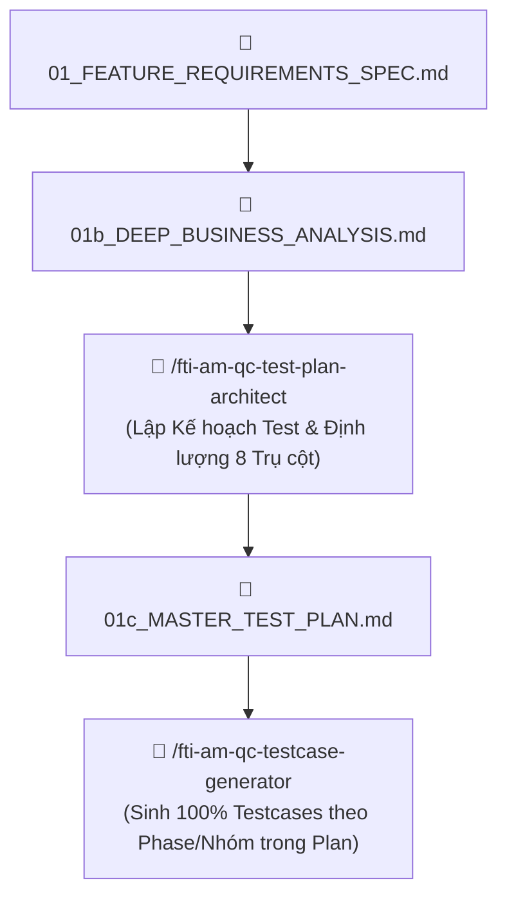
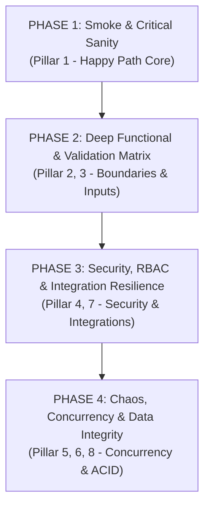

# 🎯 FTI-AM QC Test Plan Architect — Master Strategy & 8-Pillar Variant Quantification (v1.0)

Skill này chịu trách nhiệm **Lập Kế Hoạch Kiểm Thử Chuyên Sâu & Định Lượng Biến Thể theo 8 Trụ Cột Chất Lượng (Master Test Strategy & 8-Pillar Quantification)** trước khi chuyển sang bước sinh testcase (`fti-am-qc-testcase-generator`).

📂 **File Đầu Ra**: `am-docs/QC_SESSIONS/<SESSION_ID>/01c_MASTER_TEST_PLAN.md`

---

## ⚡ I. VỊ TRÍ TRONG PIPELINE KIỂM THỬ ARCHITECTURE v6.0



---

## 🏛️ II. BỘ 8 TRỤ CỘT CHẤT LƯỢNG & ĐỊNH LƯỢNG BIẾN THỂ (8 QUALITY PILLARS)

Skill phân tích file `01b_DEEP_BUSINESS_ANALYSIS.md` và tự động **TÍNH TOÁN ĐỊNH LƯỢNG SỐ LƯỢNG BIẾN THỂ (VARIANTS)** cần kiểm thử trên đủ 8 trụ cột:

| Trụ Cột (Pillar) | Mô Tả Chuyên Sâu | Công Thức / Ngưỡng Biến Thể Tối Thiểu |
|---|---|---|
| **P1: Primary Functional Flow** | Luồng chính Happy Path, tổ hợp BMS/NonBMS/Templates, DocTypes, Luồng phê duyệt. | $\ge 20 - 40$ Variants (Phủ 100% tổ hợp loại HĐ x đối tác) |
| **P2: Negative & Malformed Inputs** | Validation đầu vào sai cú pháp, XSS payload, SQLi injection, malformed files, invalid enums. | $\ge 40 - 70$ Variants (Mỗi field $\ge 3$ negative cases) |
| **P3: Extreme Boundaries & Edge Limits** | Ngưỡng số lượng/chuỗi/ngày/file, Min-1/Max+1, overflow Notes field, 999 phiếu/ngày. | $\ge 30 - 50$ Variants (Test toàn bộ ranh giới Min/Max) |
| **P4: Security & RBAC Controls** | IDOR xem phiếu người khác, JWT forgery, privilege escalation 9 vai trò, CSRF bypass. | $\ge 30 - 50$ Variants (Test 100% ma trận phân quyền 9 role) |
| **P5: Concurrency & Race Conditions** | Double-submit click, race condition tạo trùng mã phiếu, optimistic locking failure. | $\ge 15 - 30$ Variants (Chạy song song 2-5 threads) |
| **P6: Data Integrity & Transactions** | ACID rollback khi rớt mạng middle-step, orphaned records, FK violation, audit trail integrity. | $\ge 15 - 25$ Variants (Test DB transaction rollback) |
| **P7: External Integration Resilience** | E-Sign PKI/OTP failure, BMS callback timeout/retry, FTI-CM failure, Storage down. | $\ge 20 - 35$ Variants (Mock failure 4 cổng tích hợp) |
| **P8: Implicit System Rules** | Auto-numbering sequence, soft delete, session timeout, i18n/locale, pagination/sort injection. | $\ge 15 - 30$ Variants (Audit log & Session hijack) |
| **TỔNG CỘNG BIẾN THỂ** | **Độ bao phủ 100% Zero-Omission Baseline** | **$\ge 185 - 335+$ Total Test Variants** |

---

## 🗓️ III. PHÂN CHIA NGUYÊN TẮC NHÓM & PHASE KIỂM THỬ (PHASE & GROUP DECOMPOSITION)

Để đảm bảo `/fti-am-qc-testcase-generator` tạo testcase đúng luồng, không bị trùng lặp hay sót nghiệp vụ, Kế hoạch chia toàn bộ biến thể thành **4 Phase Thực Thi Nối Tiếp**:



### 🔹 Phase 1: Smoke & Critical Sanity (Happy Path Core)
- **Mục tiêu**: Xương sống nghiệp vụ phải chạy thành công 100%.
- **Nhóm Test**: `GRP_P1_HAPPY_PATH`, `GRP_P1_APPROVAL_FLOW`.

### 🔹 Phase 2: Deep Functional & Validation Matrix (Boundaries & Inputs)
- **Mục tiêu**: Đánh chặn 100% lỗi nhập liệu và vượt ngưỡng.
- **Nhóm Test**: `GRP_P2_INPUT_VALIDATION`, `GRP_P3_BOUNDARY_LIMITS`.

### 🔹 Phase 3: Security, RBAC & Integration Resilience (Security & Integrations)
- **Mục tiêu**: Đảm bảo an toàn phân quyền và chịu lỗi dịch vụ bên thứ 3.
- **Nhóm Test**: `GRP_P4_SECURITY_RBAC`, `GRP_P7_EXTERNAL_INTEGRATION`.

### 🔹 Phase 4: Chaos, Concurrency & Data Integrity (Advanced Reliability)
- **Mục tiêu**: Chịu tải đồng thời, toàn vẹn dữ liệu DB và tuân thủ quy tắc ngầm.
- **Nhóm Test**: `GRP_P5_CONCURRENCY_RACE`, `GRP_P6_DATA_INTEGRITY`, `GRP_P8_IMPLICIT_RULES`.

---

## 📑 IV. CẤU TRÚC FILE XUẤT BẢN `01C_MASTER_TEST_PLAN.MD`

```markdown
# 🎯 KẾ HOẠCH KIỂM THỬ CHUYÊN SÂU & ĐỊNH LƯỢNG 8 TRỤ CỘT (MASTER TEST PLAN)

- **Mã Session**: `<SESSION_ID>`
- **Tên Tính Năng**: `<TÊN_TÍNH_NĂNG>`
- **Tổng Số Biến Thể Cần Test (Calculated Variants)**: `<N> Variants`
- **Số Phase Kiểm Thử**: `4 Phases (8 Groups)`
- **Trạng Thái**: `[MASTER_TEST_PLAN_VERIFIED]`

---

## 📊 1. Bảng Định Lượng Biến Thể Theo 8 Trụ Cột Chất Lượng
(Bảng liệt kê số lượng Variants cụ thể cho từng Trụ cột P1 -> P8)

## 🗓️ 2. Lộ Trình Phân Phase & Phân Nhóm Kiểm Thử (Phase & Group Breakdown)
(Đặc tả chi tiết danh sách Testcase Groups thuộc Phase 1 -> Phase 4)

## 🔗 3. Ma Trận Ánh Xạ Vết Nghiệp Vụ (Traceability Matrix 01b -> Test Groups)
(Bảng ánh xạ 100% Rules từ 01b sang từng Group & Phase ID)

## 🛡️ 4. Hướng Dẫn Kích Hoạt Sinh Testcases
> *"Đã sẵn sàng. Kích hoạt `/fti-am-qc-testcase-generator` để sinh toàn bộ <N> testcases theo đúng Kế hoạch 01c_MASTER_TEST_PLAN.md!"*
```
