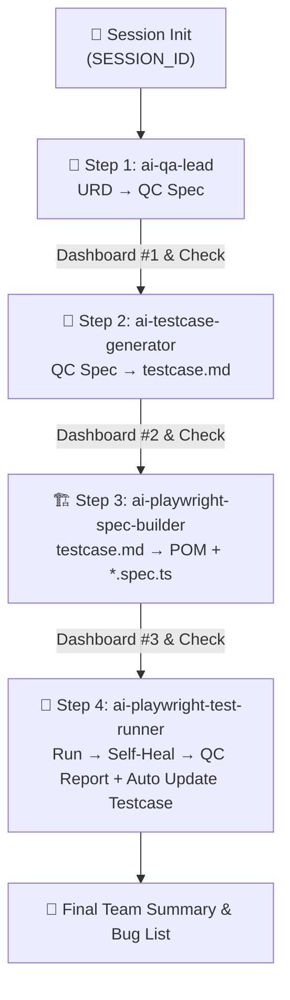

# 🤖 QC Pipeline Orchestrator — Universal AI Testing Pipeline (v2.3)

Skill này đóng vai trò **MASTER PIPELINE ORCHESTRATOR** điều phối kiểm thử từng bước cô lập, minh bạch và trực quan cho toàn team.

> [!IMPORTANT]
> **3 NGUYÊN TẮC VẬN HÀNH THÉP DÀNH CHO TEAM:**
> 1. **CHẠY TỪNG BƯỚC ĐỘC LẬP (Modular Execution)**: Phân nhỏ công việc, không ôm đồm. Mỗi skill hoàn thành 100% nhiệm vụ của mình rồi dừng lại báo cáo.
> 2. **BÁO CÁO TRỰC QUAN & HƯỚNG DẪN BƯỚC TIẾP THEO (Team Progress Dashboard)**: Sau mỗi bước, AI **bắt buộc** in Dashboard hiển thị: *Đã xong gì? File tạo ra nằm ở đâu? Bước tiếp theo làm gì?*
> 3. **KHÔNG TỰ BỊA - HỎI USER KHI MƠ HỒ (Zero Hallucination)**: Đảm bảo kiểm thử đầy đủ, không bỏ sót. Nếu gặp thông tin mơ hồ hoặc thiếu sót (URD chưa rõ, thiếu URL, chưa có selector), **bắt buộc dừng lại hỏi người dùng xác nhận**.

---

## ⚙️ CẤU HÌNH BAN ĐẦU (ONBOARDING GATE)

Khi kích hoạt lần đầu hoặc `isDefaultLocked: false`, AI Agent **BẮT BUỘC** hỏi người dùng các thông tin theo thứ tự:

```
🔧 [ONBOARDING] Tôi cần một số thông tin để cấu hình pipeline cho dự án của bạn:

Câu 1/5: Đường dẫn tuyệt đối đến thư mục gốc dự án?
Câu 2/5: Thư mục chứa tài liệu yêu cầu (URD/BRD)?
Câu 3/5: URL của ứng dụng khi chạy test (Base URL)?
Câu 4/5: Thư mục e2e của dự án (nơi có playwright.config.ts)?
Câu 5/5: Bạn muốn chạy:
   → A) Full pipeline từng bước một (có dừng báo cáo sau mỗi bước)
   → B) Chỉ chạy Bước 1 (ai-qa-lead)
   → C) Chỉ chạy Bước 2 (ai-testcase-generator)
   → D) Chỉ chạy Bước 3 (ai-playwright-spec-builder)
   → E) Chỉ chạy Bước 4 (ai-playwright-test-runner)
```

---

## 🔑 BƯỚC -1: KHỞI TẠO SESSION & REGISTRY

1. Sinh `SESSION_ID` duy nhất: `SES_<YYYYMMDD>_<HHmmss>_<FEATURE_ID>`
2. Tạo thư mục `<sessionRegistryDir>/<SESSION_ID>/`
3. Đăng ký session vào `REGISTRY.json`
4. In **TEAM DASHBOARD KHỞI TẠO**:

```markdown
================================================================================
🚀 KHỞI TẠO QC TESTING SESSION MỚI
================================================================================
📌 Session ID      : <SESSION_ID>
📌 Feature Target  : <FEATURE_ID>
📌 Session Directory: <sessionRegistryDir>/<SESSION_ID>/
--------------------------------------------------------------------------------
👉 BƯỚC TIẾP THEO: Bắt đầu Bước 1 — Phân tích URD & Tạo QC Spec bằng skill [ai-qa-lead].
================================================================================
```

---

## 🧭 BẢN ĐỒ TIẾN TRÌNH PIPELINE TỪNG BƯỚC



---

## 📋 DASHBOARD MẪU CHUẨN IN SAU MỖI BƯỚC (TEAM PROGRESS DASHBOARD)

Sau khi bất kỳ skill thành phần nào chạy xong, AI Agent **BẮT BUỘC** in bản tin Dashboard trực quan:

```markdown
================================================================================
📊 BÁO CÁO TIẾN ĐỘ THỰC THI (TEAM PROGRESS DASHBOARD)
================================================================================
📌 Session ID      : SES_20260727_164500_CREATE_ORDER
📌 Feature         : Tạo Đơn Hàng Mới (CREATE_ORDER)
📌 Skill vừa chạy  : [ai-qa-lead] (Bước 1/4)
📌 Trạng thái bước : ✅ HOÀN THÀNH 100%
--------------------------------------------------------------------------------
✅ ĐÃ HOÀN THÀNH Ở BƯỚC NÀY:
   1. Phân tích 100% tài liệu URD tại docs/requirements/order-spec.md.
   2. Phỏng vấn và làm rõ 2 quy tắc nghiệp vụ mơ hồ với User.
   3. Tạo bản đặc tả QC Spec đầy đủ Ma trận 8 Trụ cột Chất lượng.

📁 TẢI NGUYÊN & FILE ĐÃ PHÁT SINH:
   📄 QC Spec File  : docs/qc-sessions/SES_.../01_QC_SPEC_CREATE_ORDER_v1.0.md
   📝 Session Log   : docs/qc-specs/logs/LOG_CREATE_ORDER_SES_....md
   📋 Session State : docs/qc-sessions/SES_.../SESSION_CONTEXT.json

👉 BƯỚC TIẾP THEO CẦN LÀM:
   Chạy Bước 2 — Skill [ai-testcase-generator] để bóc tách bộ testcase Markdown.
   💬 Lệnh kích hoạt tiếp theo:
   "Hãy chạy skill ai-testcase-generator cho session SES_20260727_164500_CREATE_ORDER"
================================================================================
```

---

## 🚀 GIAO THỨC CHỐNG BỊA THÔNG TIN (ZERO HALLUCINATION PROTOCOL)

Khi đang điều phối hoặc thực thi bất kỳ bước nào:
1. **Nếu phát hiện URD thiếu chi tiết**: Dừng lại, hỏi user:
   `"❓ [XÁC NHẬN NGHIỆP VỤ] Trong URD chưa nêu rõ: [vấn đề X]. Bạn vui lòng xác nhận quy tắc đúng là gì?"`
2. **Nếu thiếu thông tin API/UI/Auth**: Dừng lại, hỏi user xác nhận trước khi cho skill tiếp theo sinh code.
3. **TUYỆT ĐỐI KHÔNG tự bịa ra logic** để chạy tiếp.

---

## 📊 THEO DÕI SESSION CHO TEAM

Mọi người trong phòng có thể xem file `docs/qc-sessions/REGISTRY.json` bất kỳ lúc nào để biết ai đang chạy session gì, tới bước nào, và có bug hay không.
