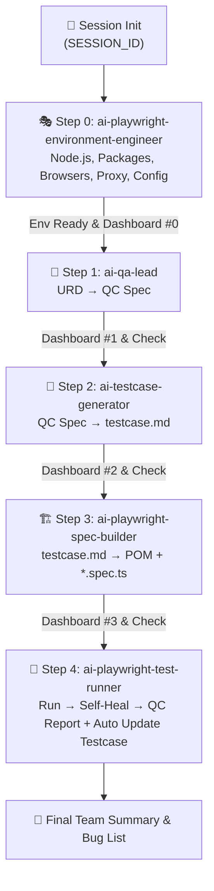

# 🤖 QC Pipeline Orchestrator — Universal AI Testing Pipeline (v2.4)

Skill này đóng vai trò **MASTER PIPELINE ORCHESTRATOR** điều phối kiểm thử từng bước cô lập, minh bạch và trực quan cho toàn team — bao gồm cả bước **Chẩn đoán & Cài đặt Môi trường Playwright Tự động (Step 0)**.

> [!IMPORTANT]
> **3 NGUYÊN TẮC VẬN HÀNH THÉP DÀNH CHO TEAM:**
> 1. **CHẠY TỪNG BƯỚC ĐỘC LẬP (Modular Execution)**: Phân nhỏ công việc, không ôm đồm. Mỗi skill hoàn thành 100% nhiệm vụ của mình rồi dừng lại báo cáo.
> 2. **BÁO CÁO TRỰC QUAN & HƯỚNG DẪN BƯỚC TIẾP THEO (Team Progress Dashboard)**: Sau mỗi bước, AI **bắt buộc** in Dashboard hiển thị: *Đã xong gì? File tạo ra nằm ở đâu? Bước tiếp theo làm gì?*
> 3. **KHÔNG TỰ BỊA - HỎI USER KHI MƠ HỒ (Zero Hallucination)**: Đảm bảo kiểm thử đầy đủ, không bỏ sót. Nếu gặp thông tin mơ hồ hoặc thiếu sót (URD chưa rõ, thiếu URL, chưa có selector), **bắt buộc dừng lại hỏi người dùng xác nhận**.

---

## ⚙️ CẤU HÌNH BAN ĐẦU & CHẨN ĐOÁN MÔI TRƯỜNG

Khi kích hoạt lần đầu hoặc `isDefaultLocked: false`, AI Agent **BẮT BUỘC** hỏi người dùng các thông tin theo thứ tự:

```
🔧 [ONBOARDING] Tôi cần một số thông tin để cấu hình pipeline cho dự án của bạn:

Câu 1/5: Đường dẫn tuyệt đối đến thư mục gốc dự án?
Câu 2/5: Thư mục chứa tài liệu yêu cầu (URD/BRD)?
Câu 3/5: URL của ứng dụng khi chạy test (Base URL)?
Câu 4/5: Thư mục e2e của dự án (nơi có playwright.config.ts)?
Câu 5/5: Bạn muốn chạy:
   → A) Full pipeline từ Bước 0 đến Bước 4 (tự động chẩn đoán môi trường -> URD -> testcase -> code -> test)
   → B) Chỉ chạy Bước 0: Chẩn đoán & Cài đặt Môi trường Playwright (ai-playwright-environment-engineer)
   → C) Chỉ chạy Bước 1: Phân tích URD (ai-qa-lead)
   → D) Chỉ chạy Bước 2: Sinh Testcase (ai-testcase-generator)
   → E) Chỉ chạy Bước 3: Sinh Code Playwright (ai-playwright-spec-builder)
   → F) Chỉ chạy Bước 4: Chạy Test & Self-Healing (ai-playwright-test-runner)
```

---

## 🔑 BƯỚC -1: KHỞI TẠO SESSION & REGISTRY

1. Sinh `SESSION_ID` duy nhất: `SES_<YYYYMMDD>_<HHmmss>_<FEATURE_ID>`
2. Tạo thư mục `<sessionRegistryDir>/<SESSION_ID>/`
3. Đăng ký session vào `REGISTRY.json`
4. In **TEAM DASHBOARD KHỞI TẠO**:

```markdown
================================================================================
🚀 KHỞI TẠO QC TESTING SESSION MỚI
================================================================================
📌 Session ID      : <SESSION_ID>
📌 Feature Target  : <FEATURE_ID>
📌 Session Directory: <sessionRegistryDir>/<SESSION_ID>/
--------------------------------------------------------------------------------
👉 BƯỚC TIẾP THEO: Bắt đầu Bước 0 — Chẩn đoán Môi trường & Auto Setup Playwright bằng skill [ai-playwright-environment-engineer].
================================================================================
```

---

## 🧭 BẢN ĐỒ TIẾN TRÌNH PIPELINE TỪNG BƯỚC (5 STEPS)



---

## 📋 PHÂN PHỐI NHIỆM VỤ 5 SKILLS CHUYÊN BIỆT

### 0. [ai-playwright-environment-engineer](../ai-playwright-environment-engineer/SKILL.md) — Environment & Setup Gate (Bước 0)
- **Nhiệm vụ**: Tự động kiểm tra Node.js, Playwright packages, Browser Binaries, Proxy/VPN, Ports, WebServer, tự cài đặt nếu thiếu, và tối ưu `playwright.config.ts` không phá vỡ dự án.

### 1. [ai-qa-lead](../ai-qa-lead/SKILL.md) — QA Lead Analyst (Bước 1)
- **Nhiệm vụ**: Đọc URD/tài liệu yêu cầu, phỏng vấn PO/user làm rõ mơ hồ (Zero Hallucination), tạo QC Master Spec.

### 2. [ai-testcase-generator](../ai-testcase-generator/SKILL.md) — Testcase Architect (Bước 2)
- **Nhiệm vụ**: Đọc QC Spec, bóc tách 8 trụ cột chất lượng thành bộ testcase Markdown chuẩn (`02_testcase.md`).

### 3. [ai-playwright-spec-builder](../ai-playwright-spec-builder/SKILL.md) — Playwright Code Generator (Bước 3)
- **Nhiệm vụ**: Đọc `02_testcase.md` + auth configs, sinh POM classes + Playwright Spec files (`*.spec.ts`).

### 4. [ai-playwright-test-runner](../ai-playwright-test-runner/SKILL.md) — Self-Healing & Visual Replay Engine (Bước 4)
- **Nhiệm vụ**: Chạy Playwright REAL mode, tự sửa lỗi script, sinh `QC_REPORT_R<N>.md` (kèm lệnh `--ui` replay), tự động cập nhật `02_testcase.md` (chứng nhận 100% PASS), sinh `BUG-*.md` và hỗ trợ recheck hai chiều.

---

## 🚀 GIAO THỨC CHỐNG BỊA THÔNG TIN (ZERO HALLUCINATION PROTOCOL)

Khi đang điều phối hoặc thực thi bất kỳ bước nào:
1. **Nếu phát hiện URD thiếu chi tiết**: Dừng lại, hỏi user:
   `"❓ [XÁC NHẬN NGHIỆP VỤ] Trong URD chưa nêu rõ: [vấn đề X]. Bạn vui lòng xác nhận quy tắc đúng là gì?"`
2. **Nếu thiếu thông tin API/UI/Auth**: Dừng lại, hỏi user xác nhận trước khi cho skill tiếp theo sinh code.
3. **TUYỆT ĐỐI KHÔNG tự bịa ra logic** để chạy tiếp.

---

## 📊 THEO DÕI SESSION CHO TEAM

Mọi người trong phòng có thể xem file `docs/qc-sessions/REGISTRY.json` bất kỳ lúc nào để biết ai đang chạy session gì, tới bước nào, và có bug hay không.
