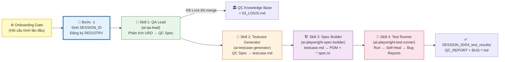

# 🤖 QC Pipeline Orchestrator — Universal AI Testing Pipeline (v2.0)

Skill này đóng vai trò **MASTER PIPELINE ORCHESTRATOR** cho toàn bộ hệ thống kiểm thử tự động. Áp dụng cho **mọi dự án phần mềm** — không phụ thuộc vào framework, ngôn ngữ hay domain nghiệp vụ.

---

## ⚙️ CẤU HÌNH BAN ĐẦU (ONBOARDING GATE — BẮT BUỘC)

Khi kích hoạt lần đầu hoặc `isDefaultLocked: false`, AI Agent **BẮT BUỘC** hỏi người dùng các thông tin sau theo thứ tự:

### Hỏi từng câu, chờ trả lời trước khi hỏi tiếp:

```
🔧 [ONBOARDING] Tôi cần một số thông tin để cấu hình pipeline cho dự án của bạn.

Câu 1/6: Đường dẫn tuyệt đối đến thư mục gốc dự án của bạn là gì?
(Ví dụ: /home/user/projects/my-app  hoặc  C:\Projects\MyApp)
```

```
Câu 2/6: Thư mục chứa tài liệu yêu cầu (URD/BRD/User Story/Spec) nằm ở đâu?
(Đường dẫn tương đối so với projectRoot. Ví dụ: docs/requirements/ hoặc docs/specs/)
```

```
Câu 3/6: URL của ứng dụng khi chạy test là gì?
(Ví dụ: http://localhost:3000 cho local, https://staging.myapp.com cho staging)
```

```
Câu 4/6: Thư mục e2e của dự án (nơi có playwright.config.ts) nằm ở đâu?
(Ví dụ: e2e/ hoặc tests/e2e/ hoặc frontend/e2e/)
```

```
Câu 5/6: File cấu hình tài khoản test (auth-roles.json) đã tồn tại chưa?
→ A) Đã có tại: [đường dẫn]
→ B) Chưa có — Tôi muốn AI giúp tạo file cấu hình tài khoản
→ C) Dự án không cần đăng nhập (public app)
```

```
Câu 6/6: Bạn muốn chạy:
→ A) Full pipeline (phân tích URD → testcase → Playwright code → chạy test)
→ B) Chỉ phân tích nghiệp vụ và tạo QC Spec
→ C) Chỉ sinh testcase từ spec có sẵn
→ D) Chỉ sinh code Playwright từ testcase có sẵn
→ E) Chỉ chạy test file đã có sẵn
```

Sau khi nhận đủ thông tin → Cập nhật `pipeline.config.json` với `isDefaultLocked: true` và tiến hành pipeline.

---

## 🔑 BƯỚC -1 (BẮT BUỘC): KHỞI TẠO SESSION DUY NHẤT

### Tình huống A — Bắt đầu session mới:
1. **Sinh SESSION_ID duy nhất**: `SES_<YYYYMMDD>_<HHmmss>_<FEATURE_ID_VIẾT_HOA>`
   - FEATURE_ID: chữ hoa, không dấu, không khoảng trắng, max 20 ký tự
   - Ví dụ: `SES_20260727_143052_CREATE_ORDER`
2. **Tạo thư mục session**: `<paths.sessionRegistryDir>/<SESSION_ID>/`
3. **Tạo SESSION_CONTEXT.json** trong thư mục đó (theo template chuẩn)
4. **Đăng ký vào REGISTRY.json** — APPEND vào `activeSessions`, KHÔNG ghi đè toàn bộ file
5. In: `🆔 [SESSION KHỞI TẠO] ID: <SESSION_ID> | Thư mục: <sessionDir>`

### Tình huống B — Resume session (`--resume <SESSION_ID>`):
1. Kiểm tra `<sessionRegistryDir>/<SESSION_ID>/SESSION_CONTEXT.json` tồn tại không
2. Nếu có: In trạng thái → Tiếp tục từ bước tiếp theo sau `lastCompletedStep`
3. Nếu không: Báo lỗi → Gợi ý kiểm tra REGISTRY.json

---

## 🧭 BẢN ĐỒ LUỒNG PIPELINE ĐẦY ĐỦ



---

## 📋 PHÂN PHỐI NHIỆM VỤ TỪNG SKILL

### 1. [ai-qa-lead](../ai-qa-lead/SKILL.md) — QA Lead Analyst
- **Nhiệm vụ**: Đọc URD/tài liệu yêu cầu, phỏng vấn PO/user nhiều vòng, tạo QC Knowledge Base độc lập
- **Multi-Agent Safe**: File Lock khi merge KB, Log phân tán theo session

### 2. [ai-testcase-generator](../ai-testcase-generator/SKILL.md) — Testcase Architect
- **Nhiệm vụ**: Đọc QC Spec, bóc tách 8 trụ cột chất lượng thành bộ testcase Markdown chuẩn
- **Multi-Agent Safe**: KB chỉ đọc, output vào `<SESSION_ID>/02_testcase.md`

### 3. [ai-playwright-spec-builder](../ai-playwright-spec-builder/SKILL.md) — Playwright Code Generator
- **Nhiệm vụ**: Đọc testcase.md + auth-roles.json, sinh POM classes + Playwright Spec files
- **Multi-Agent Safe**: Output vào `<SESSION_ID>/03_playwright/`

### 4. [ai-playwright-test-runner](../ai-playwright-test-runner/SKILL.md) — Self-Healing Execution Engine
- **Nhiệm vụ**: Chạy Playwright REAL mode, tự sửa lỗi script, báo cáo bug thực tế
- **Multi-Agent Safe**: Kết quả vào `<SESSION_ID>/04_test_results/`, vòng đời session → REGISTRY

---

## 🚀 GIAO THỨC PRE-CONDITION CHECK

Orchestrator kiểm tra tiên quyết TRƯỚC mỗi bước. Tất cả kiểm tra trong `<sessionDir>/` riêng:

| Bước | Pre-Condition | Nếu không đạt |
|---|---|---|
| Skill 1 | Thư mục session `<SESSION_ID>/` đã tạo | Quay lại Bước -1 |
| Skill 2 | `<SESSION_ID>/01_QC_SPEC_*.md` tồn tại | `⛔ Chưa có QC Spec. Chạy ai-qa-lead trước.` |
| Skill 3 | `<SESSION_ID>/02_testcase.md` tồn tại | `⛔ Chưa có Testcase. Chạy ai-testcase-generator trước.` |
| Skill 4 | `<SESSION_ID>/03_playwright/*.spec.ts` tồn tại | `⛔ Chưa có Playwright Spec. Chạy ai-playwright-spec-builder trước.` |

### Chế độ Skip thông minh:
- Đã có `testcase.md` → Copy vào `<SESSION_ID>/02_testcase.md` → Nhảy thẳng Skill 3
- Đã có `*.spec.ts` → Copy vào `<SESSION_ID>/03_playwright/` → Nhảy thẳng Skill 4

---

## 📊 THEO DÕI ĐA SESSION

```json
// Xem tất cả AI Agent đang chạy:
// <paths.sessionRegistryDir>/REGISTRY.json
{
  "activeSessions": [
    { "sessionId": "SES_20260727_143000_CREATE_ORDER", "currentStep": "testcase-generator", "status": "RUNNING" },
    { "sessionId": "SES_20260727_143052_PAYMENT",      "currentStep": "playwright-spec-builder", "status": "RUNNING" }
  ]
}
```

---

## 🌐 HƯỚNG DẪN DÙNG CHO DỰ ÁN MỚI

1. Copy thư mục `skills/` sang `.agents/skills/` của dự án mới
2. Copy `config/pipeline.config.json` sang `.agents/skills/` với `isDefaultLocked: false`
3. Kích hoạt `qc-pipeline-orchestrator` → AI sẽ hỏi bạn từng thông tin cần thiết
4. Sau khi điền xong → `isDefaultLocked: true` — mọi lần chạy sau không hỏi lại

---

## 💬 VÍ DỤ PROMPT KÍCH HOẠT

```
Hãy dùng qc-pipeline-orchestrator để kiểm thử tính năng "Đặt hàng online".
Tài liệu yêu cầu nằm ở docs/requirements/
```

```
Chạy full QC pipeline cho module "Quản lý nhân viên". 
Hỏi tôi nếu cần thêm thông tin về dự án.
```

```
/qc-test tính năng "Thanh toán qua Momo" — focus vào Security và Race Condition.
```
